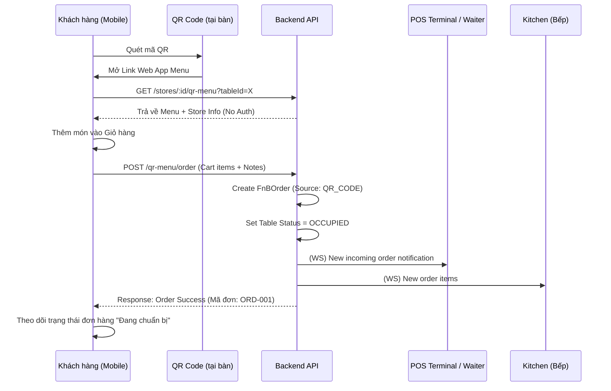

# [Feature] F23: QR Code Menu & Mobile Ordering System

## Goal

Xây dựng hệ thống thực đơn số (Digital Menu) và đặt món tại bàn thông qua mã QR. Khách hàng sử dụng điện thoại cá nhân quét mã QR tại bàn để xem menu, chọn món và gửi order trực tiếp vào hệ thống POS. Feature này giúp tối ưu hóa quy trình phục vụ, giảm thời gian chờ đợi và mang lại trải nghiệm hiện đại, "không chạm" cho khách hàng.

---

## Tại sao cần Feature này?

```
┌────────────────────────────────────────────────────────────────┐
│              VẤN ĐỀ KHÔNG CÓ FEATURE                            │
├────────────────────────────────────────────────────────────────┤
│                                                                │
│  ❌ Problem 1: Quá tải nhân viên trong giờ cao điểm           │
│     - Khách phải chờ waiter mang menu và ghi order             │
│     - Waiter tốn nhiều thời gian di chuyển qua lại             │
│                                                                │
│  ❌ Problem 2: Menu giấy khó cập nhật và thiếu sinh động       │
│     - Không hiển thị được hình ảnh món ăn chất lượng cao       │
│     - Khó sửa giá hoặc hidding món đã hết ngay lập tức         │
│                                                                │
│  ❌ Problem 3: Sai sót do truyền đạt thông tin bằng miệng      │
│     - Waiter ghi nhầm order, đặc biệt là các ghi chú đặc biệt  │
│     - Khách hàng không kiểm soát được giỏ hàng trước khi đặt   │
│                                                                │
├────────────────────────────────────────────────────────────────┤
│               GIẢI PHÁP: QR CODE ORDERING (F23)                 │
├────────────────────────────────────────────────────────────────┤
│                                                                │
│  ✅ Solution 1: Khách tự phục vụ (Self-ordering) qua mobile    │
│  ✅ Solution 2: Menu số hóa cực đẹp, cập nhật real-time        │
│  ✅ Solution 3: Gửi order thẳng vào bếp (KDS), bỏ qua trung gian|
│  ✅ Solution 4: Thu thập data hành vi khách hàng chính xác     │
│                                                                │
└────────────────────────────────────────────────────────────────┘
```

---

## Scope

- **Bao gồm:**
  - Tạo và quản lý mã QR định danh cho từng bàn ăn (Table unique QR).
  - Web App (Mobile-first) cho khách hàng duyệt Menu không cần cài đặt ứng dụng.
  - Chức năng Giỏ hàng (Cart) và gửi Order trực tiếp vào POS.
  - Tích hợp thông báo giỏ hàng/phiếu tạm tính cho khách.
  - Hệ thống Analytics tracking: Lượt quét QR, Tỷ lệ chuyển đổi Order.
  - Real-time sync menu (Món hết hàng sẽ ẩn ngay trên điện thoại khách).
  - Cho phép khách nhập tên/số điện thoại (optional) để nhận hóa đơn điện tử.

- **Không bao gồm:**
  - Thanh toán Online (Momo/Stripe) trực tiếp trên Web App khách → Phase 2.
  - Chat trực tiếp với phục vụ qua Web App → Phase 2.
  - Tài khoản đăng nhập cho khách (Guest ordering only) → Phase 1.

---

## Dependencies

- **Depends on:** F4 (Menu Management), F16 (Table Selection UI), F6 (Order Creation)
- **Blocks:** - (Đây là feature nâng cao)

---

## Data Model

### QR System Schema

```prisma
// QR Code cho từng bàn
model TableQRCode {
  id              String   @id @default(uuid())
  table_id        String   @unique
  table           FnBTable @relation(fields: [table_id], references: [id])

  qr_url          String   // URL encoded (VD: domain.com/m/table_uuid)
  qr_image_url    String?  // S3 link ảnh QR để in

  // Settings
  is_active       Boolean  @default(true)

  // Stats
  scans_count     Int      @default(0)
  last_scanned_at DateTime?

  createdAt       DateTime @default(now())
  updatedAt       DateTime @updatedAt
}

// Session khách truy cập qua QR (Track journey)
model MobileMenuSession {
  id              String   @id @default(uuid())
  store_id        String
  table_id        String

  session_token   String   @unique // Lưu ở cookie/localstorage khách
  ip_address      String?
  device_info     String?  // VD: iOS, Android

  status          SessionStatus @default(ACTIVE)
  expires_at      DateTime // Hết hạn sau 1 tiếng không tương tác

  createdAt       DateTime @default(now())
}

enum SessionStatus { ACTIVE, ORDERED, EXPIRED }
```

---

## Business Logic & User Flow

### Guest Ordering Journey



**Các quy tắc bảo mật & vận hành:**

1. **No-Login**: Khách không cần login để đặt món (giảm friction tối đa).
2. **Rate Limiting**: Giới hạn số lượng order/phút trên mỗi IP/Thiết bị để tránh spam phá hoại.
3. **Table Verification**: Backend kiểm tra tọa độ hoặc mã token động để đảm bảo khách đang thực sự ở quán (Optional).

---

## API Endpoints

### Public Endpoints (No Auth)

| Method | Endpoint                              | Mô tả                     |
| ------ | ------------------------------------- | ------------------------- |
| GET    | `/api/v1/qr-menu/:storeId`            | Lấy menu và info cửa hàng |
| POST   | `/api/v1/qr-menu/order`               | Đặt món từ giỏ hàng       |
| GET    | `/api/v1/qr-menu/order/:sessionToken` | Theo dõi trạng thái đơn   |

### Admin Endpoints (Manager Auth)

| Method | Endpoint                           | Mô tả                       |
| ------ | ---------------------------------- | --------------------------- |
| POST   | `/api/v1/admin/qr-codes/generate`  | Gen mã QR cho danh sách bàn |
| GET    | `/api/v1/admin/qr-codes/analytics` | Xem report hiệu quả QR      |

---

## Acceptance Criteria

- [ ] AC1: Hệ thống generate được mã QR duy nhất cho mỗi bàn trong Store.
- [ ] AC2: Web App mobile hiển thị menu đẹp, mượt mà trên cả iOS và Android.
- [ ] AC3: Khách đặt món không cần login, giỏ hàng hoạt động chính xác.
- [ ] AC4: Order từ QR đồng bộ ngay lập tức vào POS và KDS giống như Order từ waiter.
- [ ] AC5: Tự động khóa bàn (OCCUPIED) khi có order đầu tiên từ QR.
- [ ] AC6: Tracking được lượt quét QR và tỷ lệ chuyển đổi đơn hàng trung bình.

---

## Checklists

| Task ID | Task                                 | Est. | Status |
| ------- | ------------------------------------ | ---- | ------ |
| F23-001 | QR Code generation service (Library) | 2h   | ⬜     |
| F23-002 | Public Menu API (Unauthenticated)    | 3h   | ⬜     |
| F23-003 | Order submission from QR context     | 4h   | ⬜     |
| F23-004 | Session management (Token-based)     | 2h   | ⬜     |
| F23-005 | Analytics tracking logic             | 3h   | ⬜     |
| F23-006 | Mobile UI for Menu & Cart (React)    | 8h   | ⬜     |

---

## Labels

`feature` `qr-order` `mobile` `advanced` `digital-menu`
