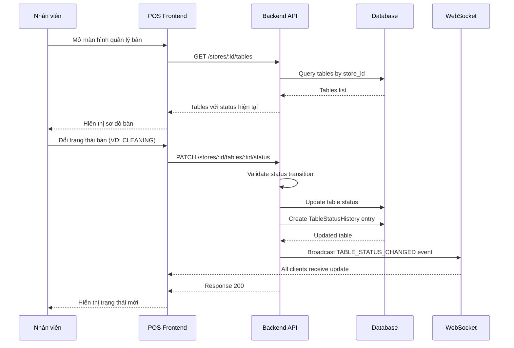
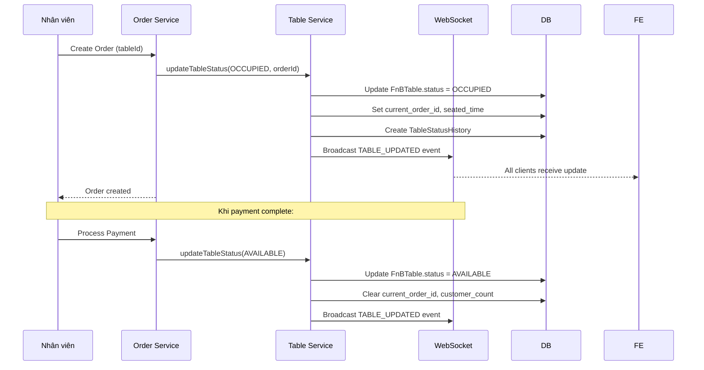

# [Feature] F3: Table Management & Status Tracking

## Goal

Xây dựng hệ thống quản lý bàn toàn diện cho nhà hàng bao gồm CRUD bàn, theo dõi trạng thái thời gian thực qua WebSocket (update sau), và cấu hình vị trí. Feature hoàn thành thì Manager có thể tạo/quản lý tất cả bàn, nhân viên xem trạng thái real-time và thay đổi trạng thái bàn theo quy trình nghiệp vụ.

---

## Tại sao cần Feature này?

```
┌────────────────────────────────────────────────────────────────┐
│              VẤN ĐỀ KHÔNG CÓ FEATURE                            │
├────────────────────────────────────────────────────────────────┤
│                                                                │
│  ❌ Problem 1: Không biết bàn nào đang trống/có khách          │
│     - Nhân viên phải đi kiểm tra từng bàn                      │
│     - Tốn thời gian, dễ nhầm lẫn                               │
│     - Khách hàng chờ lâu để được xếp bàn                      │
│                                                                │
│  ❌ Problem 2: Không tracking được lịch sử sử dụng bàn         │
│     - Không biết bàn nào hay hỏng, bỏ dở                      │
│     - Không có audit trail cho quản lý                         │
│     - Khó báo cáo hiệu quả sử dụng bàn                        │
│                                                                │
│  ❌ Problem 3: Không đồng bộ thông tin giữa các nhân viên      │
│     - Nhiều nhân viên nhận bàn cùng lúc                        │
│     - Phối hợp kém, xung đột thông tin                         │
│                                                                │
├────────────────────────────────────────────────────────────────┤
│               GIẢI PHÁP: TABLE MANAGEMENT (F3)                  │
├────────────────────────────────────────────────────────────────┤
│                                                                │
│  ✅ Solution 1: Real-time dashboard trạng thái bàn             │
│  ✅ Solution 2: WebSocket cập nhật tức thì mọi nghiệp vụ       │
│  ✅ Solution 3: Status history - audit trail đầy đủ            │
│  ✅ Solution 4: Tự động cập nhật status khi tạo/thanh toán đơn │
│                                                                │
└────────────────────────────────────────────────────────────────┘
```

---

## Scope

- **Bao gồm:**
  - CRUD bàn (tạo, xem, sửa, xóa mềm)
  - Quản lý status bàn (AVAILABLE, OCCUPIED, CLEANING, RESERVED, OUT_OF_SERVICE)
  - Định nghĩa vị trí bàn (location)
  - Real-time updates qua WebSocket
  - Status history (audit trail)
  - Auto-update status khi create/pay order

- **Không bao gồm:**
  - Ghép bàn (table merging) → Phase 2
  - Đặt bàn trước (reservation system) → F21 hay feature khác
  - Phân tích hiệu quả sử dụng bàn (table analytics) → F13

---

## Dependencies

- **Depends on:** F1 (Auth & Multi-Tenant), F2 (F&B Config Management)
- **Blocks:** F6 (Order Creation), F9 (KDS), F10 (Table Status Management), F13 (Table Analytics), F16 (Table Selection UI)

---

## Data Model

### Table Management Schema

```prisma
model FnBTable {
  id              String   @id @default(uuid())
  store_id        String
  store           Store    @relation(fields: [store_id], references: [id], onDelete: Cascade)

  // Table Info
  code            String   // T01, T02... (unique per store)
  name            String   // Bàn 1, Bàn góc cửa sổ
  capacity        Int      // 2, 4, 6... khách tối đa
  location_id     String?  // Khu A, Ngoài trời (from FnBCategory)
  seating_order   Int      @default(0)

  // Status
  status          FnBTableStatus @default(AVAILABLE)
  status_changed_at DateTime?

  // Tracking
  current_order_id String?
  customer_count  Int?     // Số khách hiện tại
  seated_time     DateTime? // Khi bắt đầu order

  is_active       Boolean  @default(true)
  createdAt       DateTime @default(now())
  updatedAt       DateTime @updatedAt

  // Relations
  orders          FnBOrder[]

  // Unique & Indexes
  @@unique([store_id, code])
  @@index([store_id, status])
  @@index([store_id, code])
}

enum FnBTableStatus {
  AVAILABLE      // Trống, sẵn sàng
  OCCUPIED       // Có khách
  CLEANING       // Đang dọn dẹp
  RESERVED       // Đặt trước
  OUT_OF_SERVICE // Không sử dụng (hỏng, sửa chữa)
}

// Table Status History (audit trail)
model TableStatusHistory {
  id              String   @id @default(uuid())
  table_id        String
  table           FnBTable @relation(fields: [table_id], references: [id])

  previous_status FnBTableStatus
  new_status      FnBTableStatus
  changed_by      String   // user_id
  reason          String?

  createdAt       DateTime @default(now())

  @@index([table_id, createdAt])
}
```

**Giải thích model:**

- `code`: Mã bàn ngắn, unique per store (T01, T02), dùng để hiển thị
- `name`: Tên mô tả (Bàn 1, Bàn góc cửa sổ)
- `location_id`: Tham chiếu đến `FnBCategory` với type=`TABLE_LOCATION`
- `seating_order`: Thứ tự hiển thị trong layout
- `status_changed_at`: Timestamp lần cuối đổi trạng thái
- `current_order_id`: Order đang active trên bàn này
- `@@unique([store_id, code])`: Đảm bảo mã bàn unique trong cùng store
- `@@index([store_id, status])`: Tối ưu query lọc bàn theo status

---

## API Endpoints

### Public Endpoints (read-only)

| Method | Endpoint                                 | Mô tả              | Auth    |
| ------ | ---------------------------------------- | ------------------ | ------- |
| GET    | `/api/v1/stores/:id/tables`              | List all tables    | Staff+  |
| GET    | `/api/v1/stores/:id/tables/:tid`         | Get table detail   | Staff+  |
| GET    | `/api/v1/stores/:id/tables/:tid/history` | Get status history | Manager |

### Admin Endpoints (write permissions)

| Method | Endpoint                                | Mô tả               | Auth    |
| ------ | --------------------------------------- | ------------------- | ------- |
| POST   | `/api/v1/stores/:id/tables`             | Create table        | Manager |
| PUT    | `/api/v1/stores/:id/tables/:tid`        | Update table info   | Manager |
| DELETE | `/api/v1/stores/:id/tables/:tid`        | Soft delete table   | Manager |
| PATCH  | `/api/v1/stores/:id/tables/:tid/status` | Change table status | Staff+  |

### WebSocket

| Channel                    | Mô tả                   | Auth   |
| -------------------------- | ----------------------- | ------ |
| WS `/ws/stores/:id/tables` | Real-time table updates | Staff+ |

### Example Request/Response

```json
// POST /api/v1/stores/:storeId/tables
// Request:
{
  "code": "T01",
  "name": "Bàn góc cửa sổ",
  "capacity": 4,
  "location_id": "loc_uuid",
  "seating_order": 1
}

// Response 201:
{
  "success": true,
  "data": {
    "id": "table_uuid",
    "code": "T01",
    "name": "Bàn góc cửa sổ",
    "capacity": 4,
    "status": "AVAILABLE",
    "location": "Khu A",
    "seatingOrder": 1,
    "createdAt": "2026-03-06T10:00:00Z"
  }
}

// GET /api/v1/stores/:storeId/tables
// Response 200:
{
  "success": true,
  "data": [
    {
      "id": "table_uuid1",
      "code": "T01",
      "name": "Bàn 1",
      "capacity": 4,
      "status": "AVAILABLE",
      "customerCount": null,
      "activeOrder": null
    },
    {
      "id": "table_uuid2",
      "code": "T02",
      "name": "Bàn 2",
      "capacity": 2,
      "status": "OCCUPIED",
      "customerCount": 2,
      "activeOrder": {
        "id": "order_uuid",
        "code": "ORD00001",
        "seatedTime": "2026-03-06T11:00:00Z",
        "total": 150000
      }
    }
  ],
  "pagination": {
    "total": 10,
    "page": 1,
    "limit": 20
  }
}

// PATCH /api/v1/stores/:storeId/tables/:tableId/status
// Request:
{
  "status": "CLEANING",
  "reason": "Khách vừa rời đi"
}

// Response 200:
{
  "success": true,
  "data": {
    "id": "table_uuid",
    "code": "T01",
    "status": "CLEANING",
    "statusChangedAt": "2026-03-06T11:30:00Z"
  }
}
```

---

## Business Logic & User Flow

### Table Status Management Flow



### Order Creation Auto-Update Flow



**Giải thích:**

- **Auto-transition AVAILABLE→OCCUPIED**: Xảy ra tự động khi tạo Order, không cần nhân viên thao tác.
- **Auto-transition OCCUPIED→AVAILABLE**: Xảy ra tự động khi thanh toán xong (F7).
- **Manual transitions**: CLEANING, RESERVED, OUT_OF_SERVICE phải do nhân viên/manager thực hiện thủ công.
- **WebSocket broadcast**: Mọi thay đổi status → tất cả clients nhận update → không cần refresh.

---

## Table Status Transition Rules

```
┌──────────────────────────────────────────────────────────────┐
│              TABLE STATUS TRANSITION RULES                    │
├──────────────────────────────────────────────────────────────┤
│                                                              │
│  AVAILABLE (✓)                                               │
│    ├─→ OCCUPIED    (auto: khi create order)                  │
│    ├─→ RESERVED    (manual: manager đặt trước)               │
│    └─→ OUT_OF_SERVICE (manual: manager)                      │
│                                                              │
│  OCCUPIED (✓)                                                │
│    ├─→ AVAILABLE   (auto: khi payment done)                  │
│    └─→ CLEANING    (manual: waiter sau khi khách đi)         │
│                                                              │
│  CLEANING (✓)                                                │
│    ├─→ AVAILABLE   (manual: nhân viên xác nhận dọn xong)     │
│    └─→ OCCUPIED    (edge case: order vẫn còn pending)        │
│                                                              │
│  RESERVED (✓)                                                │
│    ├─→ OCCUPIED    (khi khách tới nhận bàn)                  │
│    └─→ AVAILABLE   (cancel reservation)                      │
│                                                              │
│  OUT_OF_SERVICE (✓)                                          │
│    └─→ AVAILABLE   (manager xác nhận đã sửa xong)           │
│                                                              │
│  VALIDATION: Cannot transition to invalid state              │
│  ERROR: 422 if invalid transition attempted                  │
│                                                              │
└──────────────────────────────────────────────────────────────┘
```

### WebSocket Events

```typescript
// Server → Client: Khi có thay đổi bàn
{
  event: "TABLE_UPDATED",
  data: {
    tableId: "table_uuid",
    code: "T01",
    status: "OCCUPIED",
    customerCount: 3,
    orderId: "order_uuid",
    statusChangedAt: "2026-03-06T11:00:00Z"
  }
}

// Server → Client: Refresh toàn bộ danh sách
{
  event: "TABLE_LIST_REFRESH",
  data: {
    tables: [...]
  }
}
```

---

## Validation Rules

### Input Validation

```typescript
interface CreateTableDto {
  code: {
    required: true,
    type: "string",
    pattern: /^[A-Z0-9]{2,10}$/,   // T01, VIP1, OUT1
    error: "Mã bàn phải 2-10 ký tự chữ hoa/số"
  },
  name: {
    required: true,
    type: "string",
    min_length: 2,
    max_length: 100,
    error: "Tên bàn phải 2-100 ký tự"
  },
  capacity: {
    required: true,
    type: "number",
    min: 1,
    max: 50,
    error: "Sức chứa phải từ 1-50 khách"
  },
  seating_order: {
    required: false,
    type: "number",
    min: 0,
    error: "Thứ tự hiển thị phải >= 0"
  }
}

interface ChangeStatusDto {
  status: {
    enum: ["AVAILABLE", "OCCUPIED", "CLEANING", "RESERVED", "OUT_OF_SERVICE"],
    error: "Trạng thái không hợp lệ"
  },
  reason: {
    required: false,
    type: "string",
    max_length: 500
  }
}
```

### Business Rule Validation

- **Rule 1:** Mã bàn (code) phải unique trong cùng một store
- **Rule 2:** Không thể xóa bàn đang ở trạng thái OCCUPIED
- **Rule 3:** Chỉ thực hiện transition status hợp lệ (theo state machine trên)
- **Rule 4:** Không thể đổi status bàn OCCUPIED về AVAILABLE thủ công (phải qua thanh toán)
- **Rule 5:** Mỗi query PHẢI filter theo `store_id` để đảm bảo isolation

---

## Caching Strategy

```typescript
// Cache keys
const cacheKeys = {
  tableList: `tables:${storeId}`,          // TTL: 5 phút
  tableDetail: `table:${tableId}`,         // TTL: 15 phút
};

// Invalidation on write
const updateTableStatus = async (tableId, status) => {
  // Update DB
  const updated = await db.fnBTable.update({ ... });

  // Invalidate cache
  await redis.del(`tables:${storeId}`);
  await redis.del(`table:${tableId}`);

  // Broadcast WebSocket
  await wsServer.emit(`store:${storeId}`, {
    event: "TABLE_UPDATED",
    data: updated
  });

  return updated;
};
```

> **Lưu ý:** Table status thay đổi thường xuyên, TTL ngắn (5 phút) để giảm stale data. Real-time update qua WebSocket nên cache chủ yếu dùng để phục vụ first-load.

---

## Performance Targets

| Metric              | Target         | Notes                        |
| ------------------- | -------------- | ---------------------------- |
| API response time   | <200ms         | P95 latency                  |
| WebSocket latency   | <50ms          | Status update broadcast      |
| Cache hit rate      | >70%           | Cho list tables (read-heavy) |
| Concurrent clients  | 100+ per store | WebSocket connections        |
| Database query time | <50ms          | Single table query (P99)     |
| Status transition   | <100ms         | DB write + WS broadcast      |

---

## Security Considerations

```
┌────────────────────────────────────────────────────────────────┐
│                SECURITY MEASURES                                │
├────────────────────────────────────────────────────────────────┤
│                                                                │
│  🔐 Data Protection:                                            │
│     - Mọi query filter theo store_id từ JWT context            │
│     - Soft delete (không xóa vật lý khỏi DB)                  │
│     - Sensitive fields không expose qua API public             │
│                                                                │
│  🔑 Access Control:                                             │
│     - GET tables: Staff+ (tất cả nhân viên)                    │
│     - POST/PUT/DELETE: Manager+ (chỉ quản lý)                  │
│     - PATCH status: Staff+ (nhân viên có thể đổi trạng thái)  │
│     - GET history: Manager+ (audit trail)                      │
│                                                                │
│  📊 Audit & Logging:                                            │
│     - Mọi thay đổi status lưu vào TableStatusHistory          │
│     - Ghi lại changed_by (user_id), thời điểm, lý do          │
│     - Log retention: 90 ngày                                   │
│                                                                │
└────────────────────────────────────────────────────────────────┘
```

---

## Acceptance Criteria

- [ ] AC1: [Create] Có thể tạo bàn với mã unique per store
- [ ] AC2: [Read] Có thể xem danh sách bàn với status hiện tại + active order info
- [ ] AC3: [Update] Có thể cập nhật thông tin bàn (tên, sức chứa, vị trí)
- [ ] AC4: [Delete] Có thể soft delete bàn (is_active = false)
- [ ] AC5: [Status] Không thể xóa bàn đang OCCUPIED
- [ ] AC6: [Status] Status auto-update khi tạo order (AVAILABLE → OCCUPIED)
- [ ] AC7: [Status] Status auto-update khi thanh toán (OCCUPIED → AVAILABLE)
- [ ] AC8: [Status] Có thể đổi status thủ công theo rules transition
- [ ] AC9: [Status] Invalid transition trả về lỗi 422
- [ ] AC10: [Real-time] Mọi thay đổi status broadcast qua WebSocket
- [ ] AC11: [History] Mọi thay đổi status lưu vào TableStatusHistory
- [ ] AC12: [Order] Bàn sort theo seating_order
- [ ] AC13: [Security] Mọi query filter theo store_id
- [ ] AC14: [Security] RBAC đúng: Manager tạo bàn, Staff đổi status
- [ ] AC15: [Performance] API response <200ms
- [ ] AC16: [Testing] Unit + integration tests pass

---

## Checklists

### ✅ Planning

- [ ] Requirements clarified
- [ ] Data model reviewed
- [ ] API contracts defined
- [ ] User flows documented
- [ ] Dependencies identified (F1, F2)
- [ ] Estimation done

### ⚙️ Implementation

| Task ID | Task                                             | Est. | Status |
| ------- | ------------------------------------------------ | ---- | ------ |
| F3-001  | Prisma schema: FnBTable, TableStatusHistory      | 2h   | ⬜     |
| F3-002  | Migration & seed data (10 sample tables)         | 1h   | ⬜     |
| F3-003  | GET /tables, GET /tables/:id endpoints           | 2h   | ⬜     |
| F3-004  | POST /tables endpoint + validation               | 2h   | ⬜     |
| F3-005  | PUT /tables/:id endpoint                         | 1h   | ⬜     |
| F3-006  | DELETE /tables/:id                               | 1h   | ⬜     |
| F3-007  | PATCH /tables/:id/status + transition validation | 3h   | ⬜     |
| F3-008  | GET /tables/:id/history endpoint                 | 1h   | ⬜     |
| F3-009  | WebSocket integration (TABLE_UPDATED events)     | 2h   | ⬜     |
| F3-010  | Caching layer (Redis)                            | 1h   | ⬜     |
| F3-011  | RBAC guards (Manager vs Staff)                   | 1h   | ⬜     |
| F3-012  | Auto-update hook (Order creation/payment)        | 2h   | ⬜     |
| F3-013  | Unit tests (status transitions, validation)      | 3h   | ⬜     |
| F3-014  | Integration tests (full flow)                    | 2h   | ⬜     |
| F3-015  | API documentation                                | 1h   | ⬜     |

**Total Est.: ~25h**

### 🔍 Testing & Deployment

- [ ] All endpoints tested (Postman/insomnia)
- [ ] WebSocket events tested
- [ ] Validation rules verified (invalid transitions, duplicate codes)
- [ ] Cache working correctly (Redis hit/miss)
- [ ] RBAC permissions correct
- [ ] Performance targets met (<200ms API, <50ms WS)
- [ ] Security audit: all queries filter by store_id
- [ ] Documentation complete (Swagger)
- [ ] Ready for deployment

---

## Labels

`feature` `table-management` `sprint-1` `backend` `critical`

## Sprint

**Sprint 1** (Week 3-4)

## Estimated Effort

**25-30 hours**
