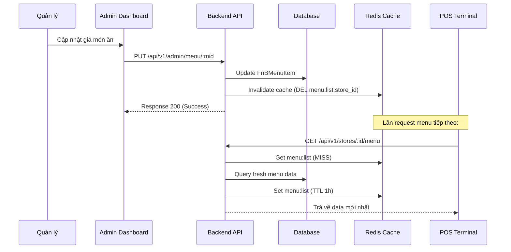

# [Feature] F4: Menu Management System

## Goal

Xây dựng hệ thống quản lý thực đơn (Menu) linh hoạt cho nhà hàng, cho phép CRUD các món ăn (Menu Items), phân loại thực đơn (Categories), quản lý giá cả, tình trạng sẵn hàng và hình ảnh. Feature này giúp Manager cấu hình thực đơn nhanh chóng, nhân viên POS truy xuất danh mục món ăn chính xác và khách hàng có thể xem thực đơn cập nhật qua QR Code.

---

## Tại sao cần Feature này?

```
┌────────────────────────────────────────────────────────────────┐
│              VẤN ĐỀ KHÔNG CÓ FEATURE                            │
├────────────────────────────────────────────────────────────────┤
│                                                                │
│  ❌ Problem 1: Khó khăn khi cập nhật thực đơn                  │
│     - Thay đổi giá hoặc món mới tốn nhiều thời gian             │
│     - In ấn lại menu giấy tốn kém                               │
│     - Sai sót thông tin giữa POS và thực tế                     │
│                                                                │
│  ❌ Problem 2: Không quản lý được tình trạng sẵn hàng          │
│     - Khách đặt món nhưng bếp báo hết                          │
│     - Nhân viên không biết món nào đang tạm ngưng               │
│     - Trải nghiệm khách hàng kém                                │
│                                                                │
│  ❌ Problem 3: Thiếu dữ liệu phân tích món ăn                  │
│     - Không biết món nào bán chạy (Best seller)                 │
│     - Khó tối ưu hóa menu theo lợi nhuận                        │
│                                                                │
├────────────────────────────────────────────────────────────────┤
│               GIẢI PHÁP: MENU MANAGEMENT (F4)                   │
├────────────────────────────────────────────────────────────────┤
│                                                                │
│  ✅ Solution 1: Quản lý Menu tập trung, cập nhật tức thì        │
│  ✅ Solution 2: Toggle "Availability" nhanh chóng               │
│  ✅ Solution 3: Phân loại món ăn khoa học theo danh mục         │
│  ✅ Solution 4: Tích hợp hình ảnh và metadata phong phú        │
│                                                                │
└────────────────────────────────────────────────────────────────┘
```

---

## Scope

- **Bao gồm:**
  - CRUD Menu Category (Danh mục món ăn)
  - CRUD Menu Item (Món ăn/Đồ uống)
  - Quản lý giá (Price) và giá vốn (Cost)
  - Tracking tình trạng sẵn hàng (Availability/Quantity limited)
  - Quản lý metadata: Hình ảnh, mô tả, nhãn (tags), thời gian chuẩn bị
  - Caching menu list qua Redis để tối ưu hiệu năng
  - Search/Filter menu theo tên, danh mục, tags

- **Không bao gồm:**
  - Menu Modifier/Options (Topping, lựa chọn thêm) → Phase 2 (Advanced)
  - Combo/Bundle (Ghép món) → Phase 2
  - Quản lý nguyên liệu (Recipe/Inventory Management) → Module Inventory

---

## Dependencies

- **Depends on:** F1 (Auth & Multi-Tenant), F2 (F&B Config Management)
- **Blocks:** F6 (Order Creation), F17 (Order Entry UI), F23 (QR Code Menu)

---

## Data Model

### Menu Management Schema

```prisma
// Menu Category
model FnBMenuCategory {
  id              String   @id @default(uuid())
  store_id        String
  store           Store    @relation(fields: [store_id], references: [id])

  name            String   // Phở, Cơm, Nước, Tráng miệng...
  description     String?
  icon            String?  // Emoji hoặc URL icon
  display_order   Int      @default(0)
  is_active       Boolean  @default(true)

  menu_items      FnBMenuItem[]

  createdAt       DateTime @default(now())
  updatedAt       DateTime @updatedAt

  @@unique([store_id, name])
  @@index([store_id, display_order])
}

// Menu Item
model FnBMenuItem {
  id              String   @id @default(uuid())
  store_id        String
  store           Store    @relation(fields: [store_id], references: [id])

  category_id     String
  category        FnBMenuCategory @relation(fields: [category_id], references: [id])

  // Product info
  name            String   // Phở Bò, Cà Phê Sữa...
  description     String?  // Thành phần, cách chế biến...
  sku             String?  // Mã nội bộ
  image_url       String?

  // Pricing
  price           Decimal  @db.Decimal(15, 2)
  cost            Decimal? @db.Decimal(15, 2) // Giá vốn để tính profit

  // Availability
  is_available    Boolean  @default(true)
  quantity_limited Boolean @default(false)
  quantity_available Int?  // Số lượng còn lại (-1 nghĩa là unlimited)

  // Metadata
  preparation_time Int?    // Phút (dùng cho KDS)
  is_spicy        Boolean? @default(false)
  is_vegetarian   Boolean? @default(false)
  allergens       String?  // JSON array: ["Lạc", "Trứng"]
  tags            String[] // ["Best Seller", "New", "Hot"]

  // Display
  display_order   Int      @default(0)

  createdAt       DateTime @default(now())
  updatedAt       DateTime @updatedAt

  // Relations
  order_items     FnBOrderItem[]

  @@unique([store_id, name])
  @@index([store_id, category_id, is_available])
  @@index([store_id, display_order])
}
```

**Giải thích model:**

- `FnBMenuCategory`: Phân loại món ăn giúp nhân viên POS và khách hàng dễ tìm kiếm.
- `sku`: Giúp Mapping với hệ thống kế toán hoặc kho khác.
- `price` vs `cost`: `price` là giá bán cho khách, `cost` dùng để tính toán biên lợi nhuận (Profit Margin) trong Analytics.
- `quantity_available`: Hỗ trợ quản lý các món có giới hạn trong ngày (VD: 50 bát phở đặc biệt).
- `preparation_time`: Giúp KDS cảnh báo khi quá thời gian chế biến.

---

## API Endpoints

### Public Endpoints (read-only)

| Method | Endpoint                             | Mô tả                 | Auth   |
| ------ | ------------------------------------ | --------------------- | ------ |
| GET    | `/api/v1/stores/:id/menu`            | List menu items (all) | Public |
| GET    | `/api/v1/stores/:id/menu/categories` | Get menu categories   | Public |
| GET    | `/api/v1/stores/:id/menu/:mid`       | Get menu item detail  | Public |

### Admin Endpoints (write permissions)

| Method | Endpoint                               | Mô tả                | Auth     |
| ------ | -------------------------------------- | -------------------- | -------- |
| POST   | `/api/v1/admin/menu`                   | Create menu item     | Manager+ |
| PUT    | `/api/v1/admin/menu/:mid`              | Update menu item     | Manager+ |
| PATCH  | `/api/v1/admin/menu/:mid/availability` | Toggle availability  | Staff+   |
| DELETE | `/api/v1/admin/menu/:mid`              | Soft delete item     | Manager+ |
| POST   | `/api/v1/admin/menu-categories`        | Create menu category | Manager+ |
| PATCH  | `/api/v1/admin/menu-categories/:cid`   | Update menu category | Manager+ |

### Example Request/Response

```json
// GET /api/v1/stores/:storeId/menu?category=pho&search=bo
Response 200:
{
  "success": true,
  "data": [
    {
      "id": "menu_uuid_1",
      "name": "Phở Bò",
      "price": 50000,
      "category": { "id": "cat_1", "name": "Phở" },
      "isAvailable": true,
      "imageUrl": "https://cdn.example.com/pho-bo.jpg",
      "tags": ["Best Seller"]
    }
  ],
  "pagination": {
    "total": 45,
    "page": 1,
    "limit": 20
  }
}

// POST /api/v1/admin/menu
Request:
{
  "categoryId": "cat_uuid_1",
  "name": "Phở Gà",
  "description": "Phở gà ta, nước dùng thanh",
  "price": 45000,
  "cost": 20000,
  "preparationTime": 10,
  "tags": ["New"]
}

Response 201:
{
  "success": true,
  "data": {
    "id": "menu_uuid_new",
    "name": "Phở Gà",
    "status": "ACTIVE",
    "isAvailable": true
  }
}
```

---

## Business Logic & User Flow

### Menu Update & Cache Invalidation Flow



**Giải thích:**

- **Caching**: Danh sách menu được cache trong Redis để giảm tải cho DB (do tần suất truy xuất rất cao).
- **Invalidation**: Bất kỳ thay đổi (Update/Create/Delete) lên menu đều phải xóa cache tương ứng của Store đó.
- **Image handling**: Khi upload hình ảnh món ăn, BE sẽ lưu trữ vào S3 và cập nhật `image_url`.

---

## Validation Rules

### Input Validation

```typescript
interface MenuValidation {
  name: {
    required: true;
    type: 'string';
    min_length: 2;
    max_length: 100;
    error: 'Tên món phải từ 2-100 ký tự';
  };
  price: {
    required: true;
    type: 'number';
    min: 0;
    error: 'Giá bán không được âm';
  };
  categoryId: {
    required: true;
    type: 'uuid';
    error: 'Danh mục không hợp lệ';
  };
  display_order: {
    type: 'number';
    default: 0;
  };
}
```

### Business Rule Validation

- **Rule 1:** Tên món ăn (Name) phải là duy nhất trong cùng một Cửa hàng (Store).
- **Rule 2:** Giá bán (Price) khuyến nghị nên cao hơn Giá vốn (Cost).
- **Rule 3:** Mỗi món ăn băt buộc phải thuộc về một Danh mục (Category).
- **Rule 4:** Soft delete: Khi xóa món ăn, chuyển `is_active = false` (ngừng kinh doanh) thay vì xóa vật lý để giữ history trong các Order cũ.

---

## Caching Strategy

```typescript
// Cache keys
const cacheKeys = {
  menuList: `menu:list:${storeId}`,           // TTL: 1 hour
  categoryList: `menu:cats:${storeId}`,       // TTL: 2 hours
};

// Usage pattern
const getMenu = async (storeId) => {
  const cached = await redis.get(cacheKeys.menuList);
  if (cached) return JSON.parse(cached);

  const data = await db.fnBMenuItem.findMany({ ... });
  await redis.setex(cacheKeys.menuList, 3600, JSON.stringify(data));
  return data;
};
```

---

## Performance Targets

| Metric            | Target | Notes                    |
| ----------------- | ------ | ------------------------ |
| API response time | <150ms | P95 (Cached)             |
| DB query time     | <50ms  | Single item read         |
| Cache hit rate    | >95%   | For menu read operations |
| Image load time   | <500ms | CDN optimized            |

---

## Acceptance Criteria

- [ ] AC1: [CRUD Category] Tạo/Sửa/Xóa danh mục món ăn thành công.
- [ ] AC2: [CRUD Item] Tạo/Sửa/Xóa món ăn với validation (tên unique per store).
- [ ] AC3: [Display] Menu list hiển thị đúng theo `display_order`.
- [ ] AC4: [Availability] Nhân viên có thể bật/tắt nhanh tình trạng sẵn hàng của món.
- [ ] AC5: [Performance] Menu list request có cache hit trên 95% sau lần load đầu.
- [ ] AC6: [Security] Chỉ Manager/Owner được quyền chỉnh sửa giá và thông tin món.
- [ ] AC7: [Search] Tìm kiếm theo tên hoặc tag trả về kết quả chính xác và nhanh (<500ms).

---

## Checklists

### ✅ Planning

- [ ] Requirements clarified
- [ ] Data model reviewed
- [ ] API contracts defined
- [ ] Caching strategy documented

### ⚙️ Implementation

| Task ID | Task                                    | Est. | Status |
| ------- | --------------------------------------- | ---- | ------ |
| Fx-001  | Prisma schema for Category & MenuItem   | 2h   | ⬜     |
| Fx-002  | CRUD Menu Category endpoints            | 2h   | ⬜     |
| Fx-003  | CRUD Menu Item endpoints                | 3h   | ⬜     |
| Fx-004  | File upload integration (S3/Cloudinary) | 2h   | ⬜     |
| Fx-005  | Redis Caching implementation            | 1h   | ⬜     |
| Fx-006  | Search & Filter logic (Prisma)          | 2h   | ⬜     |
| Fx-007  | Unit & Integration tests                | 3h   | ⬜     |

---

## Labels

`feature` `menu-management` `sprint-1` `backend`
