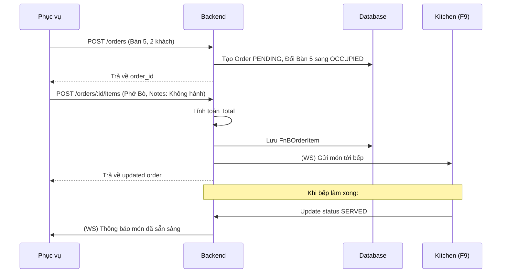

# [Feature] F6: Order Creation & Management

## Goal

Xây dựng hệ thống quản lý Order chuyên sâu cho F&B, cho phép nhân viên tạo đơn hàng theo bàn, thêm món ăn từ Menu (với ghi chú chi tiết), tự động tính toán số tiền (Subtotal, Tax, Service Charge) và theo dõi trạng thái đơn hàng thời gian thực. Feature này là hạt nhân của quá trình vận hành, kết nối giữa khu vực bàn ăn và nhà bếp.

---

## Tại sao cần Feature này?

```
┌────────────────────────────────────────────────────────────────┐
│              VẤN ĐỀ KHÔNG CÓ FEATURE                            │
├────────────────────────────────────────────────────────────────┤
│                                                                │
│  ❌ Problem 1: Sai sót khi ghi chép thủ công                   │
│     - Nhầm món, thiếu món, tính sai tiền                       │
│     - Khó theo dõi ghi chú món ăn (VD: Không hành)              │
│                                                                │
│  ❌ Problem 2: Quy trình vận hành chậm trễ                     │
│     - Waiter phải chạy từ bàn vào bếp để báo món               │
│     - Khách hàng chờ đợi lâu, giảm trải nghiệm                 │
│                                                                │
│  ❌ Problem 3: Khó khăn khi thay đổi đơn hàng                  │
│     - Khách đổi món, thêm món sau khi đã đặt                   │
│     - Khó tracking lịch sử thay đổi để hậu kiểm                │
│                                                                │
├────────────────────────────────────────────────────────────────┤
│               GIẢI PHÁP: ORDER CREATION (F6)                    │
├────────────────────────────────────────────────────────────────┤
│                                                                │
│  ✅ Solution 1: Tạo Order số hóa tức thì cho từng bàn          │
│  ✅ Solution 2: Tự động tính toán chính xác 100%               │
│  ✅ Solution 3: Ghi chú chi tiết cho từng món ăn (Order Item)   │
│  ✅ Solution 4: Real-time sync tới KDS (Kitchen)               │
│                                                                │
└────────────────────────────────────────────────────────────────┘
```

---

## Scope

- **Bao gồm:**
  - Tạo Order mới (DINE_IN, TAKEOUT, DELIVERY)
  - Thêm/Xóa/Sửa món ăn (Order Items) trong đơn hàng
  - Ghi chú riêng cho từng món ăn (VD: "Ít đường", "Không cay")
  - Tự động tính toán: Subtotal, VAT (Tax), Service Charge, Discount
  - Quản lý trạng thái Order (PENDING, CONFIRMED, COMPLETED, CANCELLED)
  - Tracking trạng thái chế biến từng món (PENDING -> PREPARING -> SERVED)
  - Real-time updates qua WebSocket tới POS và KDS

- **Không bao gồm:**
  - Thanh toán (Payment) → F7
  - Ghép Order/Chuyển bàn (Phase 2)
  - Loyalty points calculation (Voucher) → Phase 2

---

## Dependencies

- **Depends on:** F3 (Table Management), F4 (Menu Management), F5 (Store Configuration)
- **Blocks:** F7 (Order Payment), F9 (KDS), F11 (Order Modifications), F12 (Daily Analytics)

---

## Data Model

### Order Management Schema

```prisma
model FnBOrder {
  id              String   @id @default(uuid())
  store_id        String
  store           Store    @relation(fields: [store_id], references: [id])

  table_id        String?
  table           FnBTable? @relation(fields: [table_id], references: [id])

  order_code      String   // VD: ORD-2026-0001
  order_type      OrderType @default(DINE_IN)
  status          FnBOrderStatus @default(PENDING)

  // Customer Info
  customer_count  Int?
  customer_name   String?
  customer_phone  String?

  // Financials
  subtotal_amount Decimal  @default(0) @db.Decimal(15, 2)
  discount_amount Decimal  @default(0) @db.Decimal(15, 2)
  discount_rate   Decimal? @db.Decimal(5, 2)
  tax_amount      Decimal  @default(0) @db.Decimal(15, 2)
  tax_rate        Decimal  @default(10) @db.Decimal(5, 2)
  service_charge  Decimal  @default(0) @db.Decimal(15, 2)
  total_amount    Decimal  @default(0) @db.Decimal(15, 2)

  // Tracking
  notes           String?
  seated_at       DateTime?
  served_at       DateTime?
  paid_at         DateTime?

  createdAt       DateTime @default(now())
  updatedAt       DateTime @updatedAt
  deletedAt       DateTime?

  // Relations
  items           FnBOrderItem[]
  payments        FnBOrderPayment[]

  @@index([store_id, status])
  @@index([table_id, status])
}

model FnBOrderItem {
  id              String   @id @default(uuid())
  order_id        String
  order           FnBOrder @relation(fields: [order_id], references: [id], onDelete: Cascade)

  menu_item_id    String
  menu_item       FnBMenuItem @relation(fields: [menu_item_id], references: [id])

  quantity        Int      @default(1)
  unit_price      Decimal  @db.Decimal(15, 2) // Snapshot price lúc đặt món
  notes           String?  // Ghi chú phòng bếp (Vd: "Ít cay")

  subtotal        Decimal  @db.Decimal(15, 2) // quantity * unit_price
  total           Decimal  @db.Decimal(15, 2) // subtotal + tax + ...

  status          OrderItemStatus @default(PENDING)

  @@index([order_id])
}

enum OrderType { DINE_IN, TAKEOUT, DELIVERY }
enum FnBOrderStatus { PENDING, CONFIRMED, COMPLETED, CANCELLED }
enum OrderItemStatus { PENDING, PREPARING, SERVED, CANCELLED }
```

---

## API Endpoints

### Staff Endpoints (Bearer Auth)

| Method | Endpoint                                    | Mô tả                       | Auth    |
| ------ | ------------------------------------------- | --------------------------- | ------- |
| POST   | `/api/v1/stores/:id/orders`                 | Tạo Order mới (mở bàn)      | Staff+  |
| GET    | `/api/v1/stores/:id/orders`                 | Danh sách Orders đang mở    | Staff+  |
| GET    | `/api/v1/stores/:id/orders/:oid`            | Chi tiết Order              | Staff+  |
| POST   | `/api/v1/stores/:id/orders/:oid/items`      | Thêm món ăn vào đơn         | Staff+  |
| PATCH  | `/api/v1/stores/:id/orders/:oid/items/:iid` | Cập nhật số lượng/notes món | Staff+  |
| DELETE | `/api/v1/stores/:id/orders/:oid/items/:iid` | Xóa món khỏi đơn            | Staff+  |
| PATCH  | `/api/v1/stores/:id/orders/:oid/status`     | Chuyển trạng thái Order     | Manager |

### WebSocket Events

| Event           | Mô tả                                 |
| --------------- | ------------------------------------- |
| `ORDER_CREATED` | Thông báo khi có order mới            |
| `ORDER_UPDATED` | Thông báo khi đổi món/discount/status |

---

## Business Logic & User Flow

### Order Lifecycle



---

## Validation Rules

- **Rule 1:** `table_id` phải tồn tại và đang ở trạng thái `AVAILABLE` (nếu là DINE_IN).
- **Rule 2:** `quantity` của món ăn phải >= 1.
- **Rule 3:** Không thể thêm món vào Order đã ở trạng thái `COMPLETED` hoặc `CANCELLED`.
- **Rule 4:** `order_code` phải là duy nhất và tạo theo quy luật (VD: Ngày + Số thứ tự).

---

## Acceptance Criteria

- [ ] AC1: Nhân viên tạo được đơn hàng theo bàn, trạng thái bàn tự động đổi sang OCCUPIED.
- [ ] AC2: Thêm món ăn vào đơn hàng tính toán đúng Subtotal/VAT/Service charge.
- [ ] AC3: Ghi chú cho từng món được lưu và hiển thị đúng để truyền đạt xuống bếp.
- [ ] AC4: Có thể áp dụng Discount (%) lên toàn đơn hàng trước khi thanh toán.
- [ ] AC5: Toàn bộ thông tin Order đồng bộ tức thì qua WebSocket tới các thiết bị khác.

---

## Checklists

| Task ID | Task                                            | Est. | Status |
| ------- | ----------------------------------------------- | ---- | ------ |
| F6-001  | Base Order & OrderItem models setup             | 2h   | ⬜     |
| F6-002  | Logic tính toán Tổng tiền (Calculation Utility) | 2h   | ⬜     |
| F6-003  | API: Create/List/Get Orders                     | 3h   | ⬜     |
| F6-004  | API: Add/Update OrderItems                      | 3h   | ⬜     |
| F6-005  | WebSocket setup cho Order events                | 2h   | ⬜     |
| F6-006  | Unit tests cho logic tính tiền & status         | 3h   | ⬜     |

---

## Labels

`feature` `order-management` `sprint-2` `backend` `critical`
