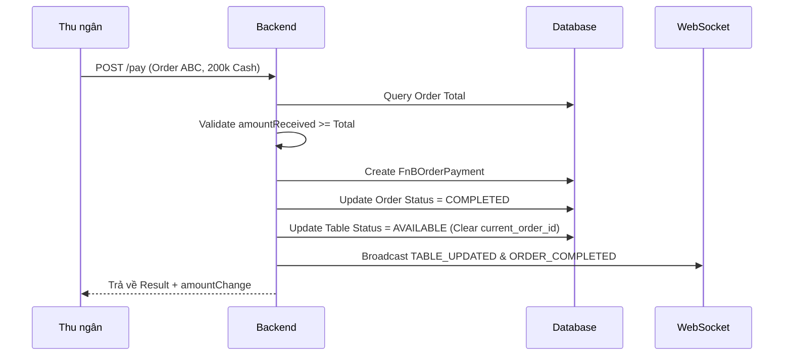

# [Feature] F7: Order Payment System

## Goal

Xây dựng hệ thống thanh toán cho các đơn hàng F&B, hỗ trợ nhiều phương thức (Tiền mặt, Thẻ, Chuyển khoản, Ví điện tử). Hệ thống tự động tính toán tiền thối, cập nhật trạng thái đơn hàng thành hoàn tất, giải phóng bàn ăn về trạng thái trống (AVAILABLE) và lưu trữ dữ liệu thanh toán phục vụ báo cáo doanh thu.

---

## Tại sao cần Feature này?

```
┌────────────────────────────────────────────────────────────────┐
│              VẤN ĐỀ KHÔNG CÓ FEATURE                            │
├────────────────────────────────────────────────────────────────┤
│                                                                │
│  ❌ Problem 1: Khó quản lý dòng tiền                           │
│     - Không biết đơn nào đã thu tiền, đơn nào chưa             │
│     - Dễ nhầm lẫn khi trả tiền thối cho khách                 │
│                                                                │
│  ❌ Problem 2: Bàn không được giải phóng kịp thời              │
│     - Order đã rút đi nhưng bàn vẫn ở trạng thái OCCUPIED      │
│     - Khách mới không có chỗ ngồi dù thực tế bàn trống         │
│                                                                │
│  ❌ Problem 3: Thiếu minh bạch trong báo cáo                   │
│     - Không tracking được phương thức thanh toán               │
│     - Khó đối soát với ngân hàng hoặc ví điện tử               │
│                                                                │
├────────────────────────────────────────────────────────────────┤
│               GIẢI PHÁP: ORDER PAYMENT (F7)                     │
├────────────────────────────────────────────────────────────────┤
│                                                                │
│  ✅ Solution 1: Xử lý thanh toán đa kênh (Cash/Card/E-wallet)  │
│  ✅ Solution 2: Tự động tính tiền thối chính xác               │
│  ✅ Solution 3: Auto-release table khi thanh toán hoàn tất      │
│  ✅ Solution 4: Đồng bộ dữ liệu doanh thu thời gian thực       │
│                                                                │
└────────────────────────────────────────────────────────────────┘
```

---

## Scope

- **Bao gồm:**
  - Xử lý thanh toán cho Order đang mở (Open Orders)
  - Hỗ trợ đa phương thức: CASH, CREDIT_CARD, BANK_TRANSFER, MOBILE_PAYMENT (Momo, ZaloPay)
  - Tính toán `amount_change` (Tiền thối) cho giao dịch tiền mặt
  - Cập nhật trạng thái Order: `CONFIRMED` -> `COMPLETED`
  - Tự động chuyển trạng thái Table: `OCCUPIED` -> `AVAILABLE`
  - Lưu chi tiết giao dịch vào model `FnBOrderPayment`
  - Tích hợp ghi chú thanh toán (VD: "Khách nợ", "Thanh toán qua mã QR")

- **Không bao gồm:**
  - Split Bill (Chia hóa đơn) → Phase 2
  - Tích hợp trực tiếp API Ngân hàng/Ví điện tử (Auto-reconciliation) → Integrations (I4)
  - Quản lý Voucher/Promo code nâng cao → Phase 2

---

## Dependencies

- **Depends on:** F6 (Order Creation)
- **Blocks:** F8 (Receipt/Invoice), F12 (Daily Analytics)

---

## Data Model

### Payment Management Schema

```prisma
model FnBOrderPayment {
  id              String   @id @default(uuid())
  order_id        String
  order           FnBOrder @relation(fields: [order_id], references: [id])

  // Payment Details
  payment_method  PaymentMethod
  amount_received Decimal  @db.Decimal(15, 2) // Tiền khách đưa
  amount_change   Decimal  @db.Decimal(15, 2) // Tiền thối lại

  // Gateway Reference (nếu có)
  gateway         String?  // VD: "Momo", "Stripe"
  transaction_id  String?  // Mã GD tham chiếu
  status          PaymentStatus @default(COMPLETED)

  notes           String?
  createdAt       DateTime @default(now())

  @@index([order_id])
}

enum PaymentMethod {
  CASH
  CREDIT_CARD
  BANK_TRANSFER
  MOBILE_PAYMENT
  VOUCHER
}

enum PaymentStatus {
  PENDING
  COMPLETED
  FAILED
  REFUNDED
}
```

---

## API Endpoints

### Cashier Endpoints (Bearer Auth)

| Method | Endpoint                                  | Mô tả                  | Auth     |
| ------ | ----------------------------------------- | ---------------------- | -------- |
| POST   | `/api/v1/stores/:id/orders/:oid/pay`      | Thực hiện thanh toán   | Cashier+ |
| GET    | `/api/v1/stores/:id/orders/:oid/payments` | Lịch sử thanh toán đơn | Staff+   |
| POST   | `/api/v1/stores/:id/payments/:pid/refund` | Hoàn tiền (Refund)     | Manager  |

### Example Request/Response

```json
// POST /api/v1/stores/:storeId/orders/:orderId/pay
Request:
{
  "paymentMethod": "CASH",
  "amountReceived": 200000,
  "gateway": null,
  "transactionId": null,
  "notes": "Khách đưa tiền mặt"
}

Response 200:
{
  "success": true,
  "data": {
    "orderId": "order_uuid",
    "totalAmount": 188100,
    "amountReceived": 200000,
    "amountChange": 11900,
    "paymentMethod": "CASH",
    "paidAt": "2026-03-07T14:00:00Z",
    "nextStatus": "COMPLETED",
    "tableStatus": "AVAILABLE"
  }
}
```

---

## Business Logic & User Flow

### Payment Workflow



**Các quy tắc quan trọng:**

1. **Validation**: Không cho phép thanh toán đơn hàng trống (No items).
2. **Table Release**: Ngay khi Order chuyển sang `COMPLETED`, bàn ăn phải được giải phóng ngay lập tức trên hệ thống để nhận khách mới.
3. **Immutability**: Giao dịch thanh toán sau khi hoàn tất không được sửa đổi, chỉ có thể `Refund` (bởi Manager).

---

## Acceptance Criteria

- [ ] AC1: Có thể thực hiện thanh toán với nhiều phương thức khác nhau.
- [ ] AC2: Tiền thối (change) được tính toán chính xác dựa trên số tiền nhận và tổng đơn.
- [ ] AC3: Order status tự động chuyển sang COMPLETED sau khi thanh toán thành công.
- [ ] AC4: Table status tự động chuyển từ OCCUPIED sang AVAILABLE.
- [ ] AC5: Giao dịch thanh toán được lưu vết đầy đủ trong database.
- [ ] AC6: Thông báo real-time tới tất cả POS terminals về trạng thái bàn mới.

---

## Checklists

| Task ID | Task                                  | Est. | Status |
| ------- | ------------------------------------- | ---- | ------ |
| F7-001  | Business Logic: Payment Calculation   | 2h   | ⬜     |
| F7-002  | API: Process Payment endpoint         | 3h   | ⬜     |
| F7-003  | Table & Order status transition hooks | 2h   | ⬜     |
| F7-004  | Refund logic & permissions            | 2h   | ⬜     |
| F7-005  | Unit tests cho payment scenarios      | 3h   | ⬜     |

---

## Labels

`feature` `payment` `sprint-2` `backend` `critical`
