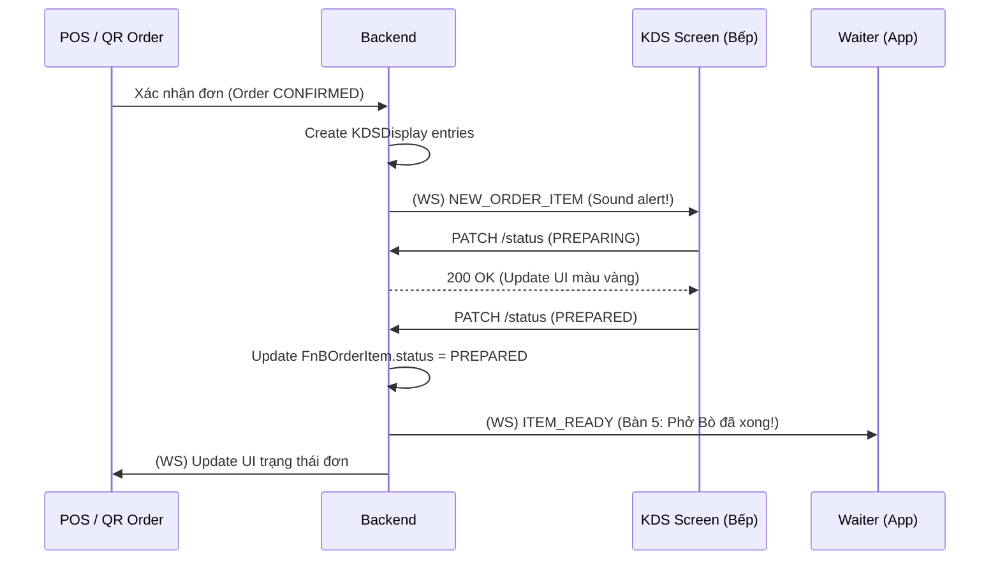

# [Feature] F9: Kitchen Display System (KDS)

## Goal

Xây dựng hệ thống màn hình hiển thị tại bếp (KDS), giúp bộ phận bếp nhận thông tin món ăn cần chế biến ngay khi có Order từ POS hoặc QR Code. KDS thay thế cho in phiếu giấy truyền thống, cho phép theo dõi thời gian chuẩn bị, cập nhật trạng thái món ăn (Đang làm, Xong) và thông báo ngược lại cho Waiter/CASHIER theo thời gian thực qua WebSocket.

---

## Tại sao cần Feature này?

```
┌────────────────────────────────────────────────────────────────┐
│              VẤN ĐỀ KHÔNG CÓ FEATURE                            │
├────────────────────────────────────────────────────────────────┤
│                                                                │
│  ❌ Problem 1: Thất lạc phiếu báo bếp                          │
│     - Phiếu giấy dễ bị mất, ướt, nhầm lẫn                      │
│     - Khó theo dõi thứ tự món (cái nào vào trước làm trước)     │
│                                                                │
│  ❌ Problem 2: Bếp và phục vụ thiếu kết nối                     │
│     - Waiter phải vào bếp hỏi món đã xong chưa                 │
│     - Bếp phải hét to hoặc rung chuông khi món xong            │
│     - Tốn sức lực, ồn ào và thiếu chuyên nghiệp               │
│                                                                │
│  ❌ Problem 3: Không đo lường được hiệu suất bếp               │
│     - Không biết trung bình món làm mất bao lâu                │
│     - Không biết món nào đang bị delay quá lâu                 │
│                                                                │
├────────────────────────────────────────────────────────────────┤
│               GIẢI PHÁP: KITCHEN DISPLAY SYSTEM (F9)            │
├────────────────────────────────────────────────────────────────┤
│                                                                │
│  ✅ Solution 1: Màn hình hiển thị Order điện tử tập trung      │
│  ✅ Solution 2: Real-time sync tức thì từ POS sang KDS         │
│  ✅ Solution 3: Tracking thời gian chuẩn bị (Preparation Time) │
│  ✅ Solution 4: Thông báo tự động khi món nấu xong             │
│                                                                │
└────────────────────────────────────────────────────────────────┘
```

---

## Scope

- **Bao gồm:**
  - Hiển thị danh sách món cần làm (Pending items) theo thứ tự thời gian.
  - Phân loại món theo Table Code và Order Code.
  - Hiển thị ghi chú món ăn từ khách hàng (VD: "Không hành").
  - Chức năng cập nhật trạng thái món: `PENDING` -> `PREPARING` -> `PREPARED`.
  - Cảnh báo món bị delay (Dựa trên `preparation_time` từ F4).
  - WebSockets để nhận Order mới và gửi thông báo món xong.
  - Ưu tiên món ăn (Urgent/Priority).

- **Không bao gồm:**
  - In tem (Label printing) cho trà sữa/coffee → Integrations (I3).
  - Quản lý kho nguyên liệu theo món (Decrement stock) → Module Inventory.
  - Phân tách màn hình theo từng khu vực bếp (Bếp Âu, Bếp Á) → Phase 2.

---

## Dependencies

- **Depends on:** F6 (Order Creation)
- **Blocks:** F15 (POS Terminal UI), I3 (Kitchen Printer)

---

## Data Model

### KDS Management Schema

```prisma
// KDS Display (Mở rộng từ OrderItem để quản lý trạng thái tại bếp)
model KDSDisplay {
  id              String   @id @default(uuid())
  store_id        String
  order_item_id   String   @unique
  order_item      FnBOrderItem @relation(fields: [order_item_id], references: [id])

  // Snapshot Data (Giảm join khi hiển thị KDS)
  itemName        String
  tableCode       String
  orderCode       String
  notes           String?
  customerCount   Int?

  status          KDSStatus @default(PENDING)
  priority        Int      @default(0) // 0=Bình thường, 1=Cần gấp

  preparationTime Int?     // Phút (Dữ liệu từ MenuItem tại F4)
  preparedAt      DateTime? // Thời điểm bếp bấm "Xong"

  createdAt       DateTime @default(now())
  updatedAt       DateTime @updatedAt

  @@index([store_id, status, priority])
  @@index([createdAt])
}

enum KDSStatus {
  PENDING    // Đang chờ
  PREPARING  // Đang chế biến
  PREPARED   // Đã xong
  SERVED     // Đã mang ra bàn
  CANCELLED  // Đã huỷ
}
```

---

## API Endpoints

### Kitchen Endpoints (Bearer Auth)

| Method | Endpoint                                     | Mô tả                        | Auth     |
| ------ | -------------------------------------------- | ---------------------------- | -------- |
| GET    | `/api/v1/stores/:id/kds/items`               | Lấy danh sách món đang chờ   | Kitchen+ |
| PATCH  | `/api/v1/stores/:id/kds/items/:iid/status`   | Cập nhật trạng thái chế biến | Kitchen+ |
| PUT    | `/api/v1/stores/:id/kds/items/:iid/priority` | Đặt mức độ ưu tiên           | Manager  |

### WebSocket Events (Namespace: /kds)

| Event            | Mô tả                                  |
| ---------------- | -------------------------------------- |
| `NEW_ORDER_ITEM` | KDS nhận món mới ngay khi POS xác nhận |
| `KDS_ITEM_READY` | Gửi về POS thông báo món đã làm xong   |

---

## Business Logic & User Flow

### KDS Workflow



**Các quy tắc vận hành:**

1. **FIFO (First In First Out)**: Món gọi trước hiển thị trước để đảm bảo công bằng.
2. **Cảnh báo Delay**: Nếu `Now - createdAt > preparationTime`, món ăn trên màn hình sẽ nháy đỏ hoặc đẩy lên đầu.
3. **Group by Table**: Bếp có thể nhìn thấy các món của cùng 1 bàn để nấu song song.

---

## Acceptance Criteria

- [ ] AC1: Món ăn xuất hiện trên KDS ngay khi Order được xác nhận (latency < 2s).
- [ ] AC2: Hiển thị đầy đủ thông tin: Tên món, Số bàn, Ghi chú đặc biệt, Thời gian đã chờ.
- [ ] AC3: Nhân viên bếp có thể chuyển trạng thái sang "Đang làm" và "Hoàn tất" bằng một lần chạm.
- [ ] AC4: Hệ thống gửi thông báo WebSocket tới phục vụ ngay khi món "Hoàn tất".
- [ ] AC5: KDS hỗ trợ lọc theo danh mục (VD: Chỉ hiển thị món Nước hoặc món Ăn).

---

## Checklists

| Task ID | Task                                      | Est. | Status |
| ------- | ----------------------------------------- | ---- | ------ |
| F9-001  | KDSDisplay Schema & Relationship          | 2h   | ⬜     |
| F9-002  | API: Get Pending Items for KDS            | 2h   | ⬜     |
| F9-003  | WebSocket: Real-time relay (Order -> KDS) | 3h   | ⬜     |
| F9-004  | Logic cảnh báo Delay (Time calculation)   | 1h   | ⬜     |
| F9-005  | KDS UI (Frontend placeholder/Mockup)      | 4h   | ⬜     |
| F9-006  | Integration tests: Luồng từ Order tới Bếp | 3h   | ⬜     |

---

## Labels

`feature` `kds` `kitchen` `sprint-3` `backend` `real-time`
