# Feature Breakdown & Dependencies - F&B Module POS System

> **Version:** 2.0  
> **Ngày tạo:** 06/03/2026  
> **Cập nhật:** Feature Dependencies Format for FNB
> **Mục đích:** Phân rã hệ thống F&B thành các feature và xác định quan hệ phụ thuộc để lập kế hoạch triển khai

---

## 1. Tổng quan Feature Graph

### 1.1 Sơ đồ Phụ thuộc Tổng thể

```mermaid
flowchart TB
    subgraph FOUNDATION["🔧 FOUNDATION (Sprint 0)"]
        F0[F0: Core Infrastructure]
        F1[F1: Auth & Multi-Tenant]
        F2[F2: F&B Config Management]
    end

    subgraph CORE["📦 CORE DATA (Sprint 1)"]
        F3[F3: Table Management]
        F4[F4: Menu Management]
        F5[F5: Store Configuration]
    end

    subgraph ORDER_PROCESSING["💳 ORDER PROCESSING (Sprint 2)"]
        F6[F6: Order Creation]
        F7[F7: Order Payment]
        F8[F8: Receipt/Invoice]
    end

    subgraph OPERATIONS["⚙️ OPERATIONS (Sprint 3)"]
        F9[F9: Kitchen Display System]
        F10[F10: Table Status Management]
        F11[F11: Order Modifications]
    end

    subgraph ANALYTICS["📊 ANALYTICS (Sprint 4)"]
        F12[F12: Daily Analytics]
        F13[F13: Table Analytics]
        F14[F14: Reports Export]
    end

    subgraph FRONTEND["🎨 FRONTEND (Sprint 4-5)"]
        F15[F15: POS Terminal UI]
        F16[F16: Table Selection UI]
        F17[F17: Order Entry UI]
        F18[F18: Payment UI]
        F19[F19: Manager Dashboard]
    end

    subgraph ADVANCED["✨ ADVANCED (Sprint 5-6)"]
        F20[F20: AI Order Suggestions]
        F21[F21: Loyalty Program]
        F22[F22: Multi-Location Sync]
        F23[F23: QR Code Menu & Mobile Ordering]
    end

    subgraph INTEGRATIONS["🔗 INTEGRATIONS (Parallel)"]
        I1[I1: POS ↔ Inventory Sync]
        I2[I2: POS ↔ Finance Sync]
        I3[I3: Kitchen Printer]
        I4[I4: Payment Gateway]
    end

    %% Foundation dependencies
    F0 --> F1
    F0 --> F2

    %% Core depends on Foundation
    F1 --> F3
    F2 --> F3
    F1 --> F4
    F2 --> F4
    F1 --> F5
    F2 --> F5

    %% Order Processing depends on Core
    F3 --> F6
    F4 --> F6
    F5 --> F6
    F6 --> F7
    F7 --> F8

    %% Operations depend on Core + Order
    F3 --> F9
    F3 --> F10
    F6 --> F9
    F6 --> F10
    F6 --> F11

    %% Analytics depend on Order
    F6 --> F12
    F7 --> F12
    F3 --> F13
    F6 --> F13
    F12 --> F14

    %% Frontend depend on Core + Order
    F3 --> F15
    F4 --> F15
    F3 --> F16
    F4 --> F17
    F6 --> F17
    F7 --> F18
    F12 --> F19

    %% Advanced features
    F12 --> F20
    F6 --> F21
    F1 --> F22
    F4 --> F23
    F16 --> F23

    %% Integrations
    F6 --> I1
    F7 --> I2
    F9 --> I3
    F7 --> I4

    classDef foundation fill:#e1f5fe,stroke:#01579b
    classDef core fill:#e8f5e9,stroke:#2e7d32
    classDef orderprocessing fill:#fff3e0,stroke:#ef6c00
    classDef operations fill:#fce4ec,stroke:#c2185b
    classDef analytics fill:#f3e5f5,stroke:#7b1fa2
    classDef frontend fill:#e0f2f1,stroke:#00695c
    classDef advanced fill:#f1f8e9,stroke:#558b2f
    classDef integrations fill:#ede7f6,stroke:#512da8

    class F0,F1,F2 foundation
    class F3,F4,F5 core
    class F6,F7,F8 orderprocessing
    class F9,F10,F11 operations
    class F12,F13,F14 analytics
    class F15,F16,F17,F18,F19 frontend
    class F20,F21,F22 advanced
    class I1,I2,I3,I4 integrations
```



### 1.2 Thứ tự Triển khai Đề xuất

| Sprint       | Features       | Mô tả                                  | Estimated Days | Team |
| ------------ | -------------- | -------------------------------------- | -------------- | ---- |
| **Sprint 0** | F0, F1, F2     | Foundation: Infra, Auth, F&B Config    | 5-7 days       | 1 BE |
| **Sprint 1** | F3, F4, F5     | Core: Table, Menu, Store Config        | 7-10 days      | 2 BE |
| **Sprint 2** | F6, F7, F8     | Order: Creation, Payment, Receipt      | 7-10 days      | 2 BE |
| **Sprint 3** | F9, F10, F11   | Operations: KDS, Status, Modifications | 7-10 days      | 2 BE |
| **Sprint 4** | F12, F13, F14  | Analytics: Daily, Table, Reports       | 7-10 days      | 1 BE |
| **Sprint 4** | F15-F19        | Frontend: UI Components                | 10-14 days     | 2 FE |
| **Sprint 5** | F20, F21, F22  | Advanced Features                      | 10-14 days     | 2 BE |
| **Sprint 6** | F23            | QR Code Menu & Mobile Ordering         | 7-10 days      | 2 BE |
| **Parallel** | I1, I2, I3, I4 | Integrations with other modules        | 10-15 days     | 1 BE |

---

## 2. Chi tiết Từng Feature

---

### F0: Core Infrastructure

#### 2.0.1 Mô tả & Phạm vi

| Thuộc tính       | Giá trị                                                            |
| ---------------- | ------------------------------------------------------------------ |
| **Feature ID**   | F0                                                                 |
| **Tên**          | Core Infrastructure                                                |
| **Mô tả**        | Setup cơ sở hạ tầng: Database, API, WebSocket, File Storage, Cache |
| **Phạm vi**      | Backend infrastructure, DevOps, Real-time messaging                |
| **Độ ưu tiên**   | Critical                                                           |
| **Dependencies** | None (Root feature)                                                |
| **Related IDs**  | INFRA-001, INFRA-002, INFRA-003, INFRA-004                         |

#### 2.0.2 Core Components

```typescript
// Technology Stack
interface CoreInfrastructure {
  database: 'PostgreSQL 14+' with Prisma ORM
  cache: 'Redis' for session/menu/analytics
  realtime: 'Socket.IO' for KDS, table updates, chat
  fileStorage: 'S3-compatible' (MinIO/Cloudflare R2)
  api: 'NestJS' REST + WebSocket + Swagger
  queue: 'Bull' for async tasks (receipts, exports)
  search: 'Elasticsearch' for advanced order search (optional Phase 2)
}

// Base Entity Interface
interface BaseEntity {
  id: string; // UUID
  createdAt: Date;
  updatedAt: Date;
  deletedAt?: Date; // Soft delete
}

// F&B-specific middleware
interface F&BMiddleware {
  StoreContextMiddleware: Inject store_id from JWT
  FnBGuard: Check business_type = F&B
  TransactionMiddleware: Atomic order operations
  LoggingMiddleware: Audit trail for orders/payments
}
```

#### 2.0.3 API Endpoints

| Method | Endpoint         | Mô tả         | Auth   |
| ------ | ---------------- | ------------- | ------ |
| GET    | `/api/v1/health` | Health check  | Public |
| GET    | `/api/v1/status` | System status | Public |
| GET    | `/api/v1/config` | F&B config    | Staff+ |

#### 2.0.4 Acceptance Criteria

- [ ] PostgreSQL connection stable, query response <200ms
- [ ] Redis cache operational, connection pooling active
- [ ] WebSocket server running, test connections work
- [ ] S3 file upload/download working <5 sec
- [ ] Health endpoint returns 200 with system info
- [ ] Swagger docs complete and accessible
- [ ] Audit logging working for critical operations
- [ ] Rate limiting enabled (100 req/min per IP for public APIs)

---

### F1: Auth & Multi-Tenant

#### 2.1.1 Mô tả & Phạm vi

| Thuộc tính       | Giá trị                                                         |
| ---------------- | --------------------------------------------------------------- |
| **Feature ID**   | F1                                                              |
| **Tên**          | Authentication & Multi-Tenant Isolation                         |
| **Mô tả**        | JWT auth, multi-provider, multi-tenant isolation cho F&B stores |
| **Phạm vi**      | Auth module, Guards, Middleware, Multi-tenant context injection |
| **Dependencies** | F0                                                              |
| **Related IDs**  | AUTH-001, AUTH-002, TENANT-001, TENANT-002                      |

#### 2.1.2 Data Models

```typescript
// User (Citizen/Staff)
model User {
  id              String   @id @default(uuid())
  store_id        String
  store           Store    @relation("StoreOwners", fields: [store_id], references: [id])

  email           String?
  phone           String?
  name            String
  avatar          String?

  role            UserRole    // OWNER, MANAGER, STAFF, CASHIER
  status          UserStatus  // ACTIVE, INACTIVE, SUSPENDED

  isAnonymous     Boolean  @default(false)

  createdAt       DateTime @default(now())
  updatedAt       DateTime @updatedAt

  // Relations
  stores_owned    Store[]  @relation("StoreOwners")
  orders          FnBOrder[]
  chatSessions    ChatSession[]

  @@index([store_id])
}

enum UserRole {
  OWNER      // Chủ cửa hàng
  MANAGER    // Quản lý
  STAFF      // Nhân viên POS
  CASHIER    // Thu ngân
  WAITER     // Phục vụ
}

enum UserStatus {
  ACTIVE
  INACTIVE
  SUSPENDED
}

// Store (extend from Retail POS)
model Store {
  id              String   @id @default(uuid())
  owner_id        String
  owner           User     @relation("StoreOwners", fields: [owner_id], references: [id])

  name            String
  phone           String?
  address         String?

  business_type   BusinessType  // RETAIL | F&B | SERVICE | etc

  // F&B specific
  fnb_config      FnBStoreConfig?

  // Relations
  users           User[]   @relation("StoreOwners")
  tables          FnBTable[]
  menu_items      FnBMenuItem[]
  orders          FnBOrder[]

  createdAt       DateTime @default(now())
  updatedAt       DateTime @updatedAt

  @@index([owner_id, business_type])
}

enum BusinessType {
  RETAIL
  F&B
  SERVICE
  RETAIL_PHARMACY
  HYBRID
}

// Admin User
model AdminUser {
  id              String   @id @default(uuid())
  email           String   @unique
  password_hash   String
  name            String
  role            AdminRole

  is_active       Boolean  @default(true)
  last_login_at   DateTime?

  createdAt       DateTime @default(now())
  updatedAt       DateTime @updatedAt

  feedback_assignments Feedback[]
}

enum AdminRole {
  SUPER_ADMIN      // Full access
  F&B_ADMIN        // F&B module only
  FINANCE_ADMIN    // Finance module only
  CONTENT_ADMIN    // Content (menu, articles) only
}
```

#### 2.1.3 API Endpoints

| Method | Endpoint                   | Mô tả                    | Auth   | Status |
| ------ | -------------------------- | ------------------------ | ------ | ------ |
| POST   | `/api/v1/auth/login`       | Đăng nhập email/password | Public | ✅     |
| POST   | `/api/v1/auth/register`    | Đăng ký account          | Public | ✅     |
| POST   | `/api/v1/auth/refresh`     | Refresh access token     | Bearer | ✅     |
| POST   | `/api/v1/auth/logout`      | Đăng xuất                | Bearer | ✅     |
| GET    | `/api/v1/auth/me`          | Get current user         | Bearer | ✅     |
| PUT    | `/api/v1/auth/profile`     | Update user profile      | Bearer | ✅     |
| POST   | `/api/v1/admin/auth/login` | Admin login              | Public | 🔜     |
| POST   | `/api/v1/admin/users`      | Create user/staff        | Admin  | 🔜     |
| GET    | `/api/v1/admin/users`      | List users by store      | Admin  | 🔜     |
| PATCH  | `/api/v1/admin/users/:id`  | Update user              | Admin  | 🔜     |
| DELETE | `/api/v1/admin/users/:id`  | Delete/deactivate user   | Admin  | 🔜     |

#### 2.1.4 Business Rules

```
┌──────────────────────────────────────────────────┐
│       MULTI-TENANT ISOLATION RULES                │
├──────────────────────────────────────────────────┤
│                                                  │
│ 1. Store Ownership:                              │
│    - User tạo store → trở thành OWNER            │
│    - Chỉ OWNER/MANAGER có quyền cấu hình         │
│    - STAFF xem/tạo order, không cấu hình         │
│    - CASHIER chỉ xử lý thanh toán                │
│                                                  │
│ 2. Data Isolation:                               │
│    - Mỗi query PHẢI filter by store_id           │
│    - Không share data giữa stores                │
│    - JWT token chứa store_id                     │
│                                                  │
│ 3. F&B Feature Gate:                             │
│    - F&B features chỉ enable nếu                 │
│      business_type = F&B hoặc HYBRID            │
│    - Check @FnBGuard trước mỗi endpoint          │
│                                                  │
│ 4. Admin RBAC:                                   │
│    - SUPER_ADMIN: Tất cả quyền                   │
│    - F&B_ADMIN: Order, Table, Menu, Payment      │
│    - CONTENT_ADMIN: Menu, Articles               │
│    - FINANCE_ADMIN: Payment, Analytics           │
│                                                  │
└──────────────────────────────────────────────────┘
```

#### 2.1.5 Acceptance Criteria

- [ ] Can login with email/password
- [ ] JWT token contains user_id, store_id, role
- [ ] Access token expires after 15 minutes
- [ ] Refresh token expires after 7 days
- [ ] Cannot access other store's data with different store_id
- [ ] All endpoints check StoreContext middleware
- [ ] Role-based access control working
- [ ] Unit tests for auth flows + isolation

---

### F2: F&B Config Management

#### 2.2.1 Mô tả & Phạm vi

| Thuộc tính       | Giá trị                                             |
| ---------------- | --------------------------------------------------- |
| **Feature ID**   | F2                                                  |
| **Tên**          | F&B Configuration Management                        |
| **Mô tả**        | Quản lý cấu hình F&B: tax, meal time, KDS, features |
| **Phạm vi**      | Config model, Admin API, Feature flags              |
| **Dependencies** | F0, F1                                              |
| **Related IDs**  | CONFIG-001, CONFIG-002, CONFIG-003, CONFIG-004      |

#### 2.2.2 Data Models

```typescript
// F&B Store Configuration
model FnBStoreConfig {
  id              String   @id @default(uuid())
  store_id        String   @unique
  store           Store    @relation(fields: [store_id], references: [id], onDelete: Cascade)

  // Business Settings
  opening_time    String?  // "09:00"
  closing_time    String?  // "23:00"
  avg_meal_time   Int      @default(45) // minutes
  max_tables      Int      @default(50)

  // Features
  enable_dine_in  Boolean  @default(true)
  enable_takeout  Boolean  @default(false)
  enable_delivery Boolean  @default(false)
  enable_kds      Boolean  @default(false) // Kitchen Display System
  enable_loyalty  Boolean  @default(false)

  // Pricing
  tax_percentage  Float    @default(10.0) // VAT
  service_charge  Float    @default(0.0)  // % nếu có
  min_order_value Float?   // Minimum order

  // Preferences
  receipt_type    ReceiptType @default(SIMPLE)
  language        String   @default("vi")
  currency        String   @default("VND")

  createdAt       DateTime @default(now())
  updatedAt       DateTime @updatedAt
}

enum ReceiptType {
  SIMPLE         // Simple text receipt
  DETAILED       // With items breakdown
  THERMAL        // Formatted for thermal printer
}

// Feedback Category (như NEWS CATEGORIES)
model FnBCategory {
  id              String   @id @default(uuid())
  store_id        String
  store           Store    @relation(fields: [store_id], references: [id])

  type            CategoryType
  name            String
  icon            String?
  order           Int      @default(0)
  is_active       Boolean  @default(true)

  @@unique([store_id, name])
  @@index([store_id, type])
}

enum CategoryType {
  TABLE_LOCATION  // Khu A, Ngoài trời, etc
  FEEDBACK        // Lĩnh vực phản ánh
  MENU            // Phân loại menu
  PROMO           // Khuyến mãi
}

// Feature Flags
model FeatureFlag {
  id              String   @id @default(uuid())
  key             String   @unique
  is_enabled      Boolean  @default(false)
  description     String?
}
```

#### 2.2.3 API Endpoints

| Method | Endpoint                       | Mô tả                  | Auth    |
| ------ | ------------------------------ | ---------------------- | ------- |
| GET    | `/api/v1/stores/:id/config`    | Get F&B config         | Staff+  |
| PUT    | `/api/v1/stores/:id/config`    | Update F&B config      | Manager |
| GET    | `/api/v1/config/categories`    | Get categories by type | Public  |
| POST   | `/api/v1/admin/categories`     | Create category        | Admin   |
| PATCH  | `/api/v1/admin/categories/:id` | Update category        | Admin   |
| DELETE | `/api/v1/admin/categories/:id` | Delete category        | Admin   |

#### 2.2.4 Default Config Values

```json
{
  "fnb_config": {
    "opening_time": "08:00",
    "closing_time": "22:00",
    "avg_meal_time": 45,
    "enable_dine_in": true,
    "enable_takeout": false,
    "enable_kds": false,
    "tax_percentage": 10.0,
    "service_charge": 0.0,
    "receipt_type": "SIMPLE"
  },
  "categories": {
    "table_locations": ["Khu A", "Khu B", "Ngoài trời", "Riêng biệt"],
    "feedback_types": ["Chất lượng thức ăn", "Phục vụ", "Vệ sinh", "Giá cả", "Khác"]
  }
}
```

#### 2.2.5 Acceptance Criteria

- [ ] Can read F&B config
- [ ] Manager can update config
- [ ] Config changes apply immediately (cache invalidation)
- [ ] Categories can be created/updated/deleted
- [ ] Feature flags control module availability
- [ ] Default values set correctly
- [ ] Unit tests for config updates

---

### F3: Table Management

#### 2.3.1 Mô tả & Phạm vi

| Thuộc tính       | Giá trị                                         |
| ---------------- | ----------------------------------------------- |
| **Feature ID**   | F3                                              |
| **Tên**          | Table Management & Status Tracking              |
| **Mô tả**        | CRUD table, quản lý status, location, capacity  |
| **Phạm vi**      | Table model, API, Status transitions, Real-time |
| **Dependencies** | F1, F2                                          |
| **Related IDs**  | TABLE-001, TABLE-002, TABLE-003, TABLE-004      |

#### 2.3.2 Data Models

```typescript
model FnBTable {
  id              String   @id @default(uuid())
  store_id        String
  store           Store    @relation(fields: [store_id], references: [id], onDelete: Cascade)

  // Table Info
  code            String   // T01, T02... (unique per store)
  name            String   // Bàn 1, Bàn góc cửa sổ
  capacity        Int      // 2, 4, 6... khách tối đa
  location_id     String?  // Khu A, Ngoài trời (from category)
  seating_order   Int      @default(0)

  // Status
  status          FnBTableStatus @default(AVAILABLE)
  status_changed_at DateTime?

  // Tracking
  current_order_id String?
  customer_count  Int?     // Số khách hiện tại
  seated_time     DateTime? // Khi bắt đầu order

  is_active       Boolean  @default(true)
  createdAt       DateTime @default(now())
  updatedAt       DateTime @updatedAt

  // Relations
  orders          FnBOrder[]

  @@unique([store_id, code])
  @@index([store_id, status])
  @@index([store_id, code])
}

enum FnBTableStatus {
  AVAILABLE    // Trống, sẵn sàng
  OCCUPIED     // Có khách
  CLEANING     // Đang dọn dẹp
  RESERVED     // Đặt trước
  OUT_OF_SERVICE // Không sử dụng (bị vỡ, etc)
}

// Table Status History (audit trail)
model TableStatusHistory {
  id              String   @id @default(uuid())
  table_id        String
  table           FnBTable @relation(fields: [table_id], references: [id])

  previous_status FnBTableStatus
  new_status      FnBTableStatus
  changed_by      String   // user_id
  reason          String?

  createdAt       DateTime @default(now())

  @@index([table_id, createdAt])
}
```

#### 2.3.3 API Endpoints

| Method | Endpoint                                 | Mô tả                   | Auth    |
| ------ | ---------------------------------------- | ----------------------- | ------- |
| POST   | `/api/v1/stores/:id/tables`              | Create table            | Manager |
| GET    | `/api/v1/stores/:id/tables`              | List all tables         | Staff+  |
| GET    | `/api/v1/stores/:id/tables/:tid`         | Get table detail        | Staff+  |
| PUT    | `/api/v1/stores/:id/tables/:tid`         | Update table info       | Manager |
| DELETE | `/api/v1/stores/:id/tables/:tid`         | Soft delete table       | Manager |
| PATCH  | `/api/v1/stores/:id/tables/:tid/status`  | Change table status     | Staff+  |
| GET    | `/api/v1/stores/:id/tables/:tid/history` | Get status history      | Manager |
| WS     | `/ws/stores/:id/tables`                  | Real-time table updates | Staff+  |

#### 2.3.4 API Request/Response Examples

```json
POST /api/v1/stores/:storeId/tables
{
  "code": "T01",
  "name": "Bàn góc cửa sổ",
  "capacity": 4,
  "location_id": "loc_uuid",
  "seating_order": 1
}

Response 201:
{
  "success": true,
  "data": {
    "id": "table_uuid",
    "code": "T01",
    "name": "Bàn góc cửa sổ",
    "capacity": 4,
    "status": "AVAILABLE",
    "location": "Khu A",
    "createdAt": "2026-03-04T10:00:00Z"
  }
}

GET /api/v1/stores/:storeId/tables
Response 200:
{
  "success": true,
  "data": [
    {
      "id": "table_uuid1",
      "code": "T01",
      "name": "Bàn 1",
      "capacity": 4,
      "status": "AVAILABLE",
      "customerCount": null,
      "activeOrder": null
    },
    {
      "id": "table_uuid2",
      "code": "T02",
      "name": "Bàn 2",
      "capacity": 2,
      "status": "OCCUPIED",
      "customerCount": 2,
      "activeOrder": {
        "id": "order_uuid",
        "code": "ORD00001",
        "seatedTime": "2026-03-04T11:00:00Z",
        "total": 150000
      }
    }
  ],
  "pagination": {
    "total": 10,
    "page": 1,
    "limit": 20
  }
}

PATCH /api/v1/stores/:storeId/tables/:tableId/status
{
  "status": "CLEANING",
  "reason": "Khách vừa rời đi"
}

Response 200:
{
  "success": true,
  "data": {
    "id": "table_uuid",
    "code": "T01",
    "status": "CLEANING",
    "statusChangedAt": "2026-03-04T11:30:00Z"
  }
}

WS Event (Real-time update):
{
  "event": "TABLE_STATUS_CHANGED",
  "data": {
    "tableId": "table_uuid",
    "status": "OCCUPIED",
    "orderId": "order_uuid"
  }
}
```

#### 2.3.5 Table Status Transitions

```
┌──────────────────────────────────────────────┐
│     TABLE STATUS TRANSITION RULES            │
├──────────────────────────────────────────────┤
│                                              │
│  AVAILABLE (✓)                               │
│    ├─→ OCCUPIED (khi create order)           │
│    ├─→ RESERVED (manual, manager)            │
│    └─→ OUT_OF_SERVICE (manual, manager)      │
│                                              │
│  OCCUPIED (✓)                                │
│    ├─→ AVAILABLE (khi payment done)          │
│    └─→ CLEANING (manual, waiter)             │
│                                              │
│  CLEANING (✓)                                │
│    ├─→ AVAILABLE (confirm dọn xong)          │
│    └─→ OCCUPIED (if order still pending)     │
│                                              │
│  RESERVED (✓)                                │
│    ├─→ OCCUPIED (khi khách tới)              │
│    └─→ AVAILABLE (cancel reserve)            │
│                                              │
│  OUT_OF_SERVICE (✓)                          │
│    └─→ AVAILABLE (manager confirm fixed)     │
│                                              │
└──────────────────────────────────────────────┘
```

#### 2.3.6 WebSocket Events

```typescript
// Client receives
{
  event: "TABLE_UPDATED",
  data: {
    tableId: "table_uuid",
    status: "OCCUPIED",
    customerCount: 3,
    orderId: "order_uuid"
  }
}

{
  event: "TABLE_LIST_REFRESH",
  data: {
    tables: [...]
  }
}
```

#### 2.3.7 Acceptance Criteria

- [ ] Can create table with unique code per store
- [ ] Can list all tables with current status
- [ ] Can change table status manually
- [ ] Status auto-updates when order created/paid
- [ ] Cannot delete table if OCCUPIED
- [ ] Table ordered by seating_order
- [ ] Real-time updates via WebSocket
- [ ] Status history tracked
- [ ] Unit + integration tests

---

### F4: Menu Management

#### 2.4.1 Mô tả & Phạm vi

| Thuộc tính       | Giá trị                                            |
| ---------------- | -------------------------------------------------- |
| **Feature ID**   | F4                                                 |
| **Tên**          | Menu Management System                             |
| **Mô tả**        | CRUD menu items, categories, pricing, availability |
| **Phạm vi**      | Menu models, API, Admin CMS, Caching               |
| **Dependencies** | F1, F2                                             |
| **Related IDs**  | MENU-001, MENU-002, MENU-003, MENU-004, MENU-005   |

#### 2.4.2 Data Models

```typescript
// Menu Category (extended from F2)
model FnBMenuCategory {
  id              String   @id @default(uuid())
  store_id        String
  store           Store    @relation(fields: [store_id], references: [id])

  name            String   // Phở, Cơm, Nước, Dessert
  description     String?
  icon            String?
  display_order   Int      @default(0)
  is_active       Boolean  @default(true)

  menu_items      FnBMenuItem[]

  createdAt       DateTime @default(now())
  updatedAt       DateTime @updatedAt

  @@unique([store_id, name])
  @@index([store_id, display_order])
}

// Menu Item
model FnBMenuItem {
  id              String   @id @default(uuid())
  store_id        String
  store           Store    @relation(fields: [store_id], references: [id])

  category_id     String
  category        FnBMenuCategory @relation(fields: [category_id], references: [id])

  // Product info
  name            String   // Phở Bò, Cơm Tấm Chiên
  description     String?  // Chi tiết, thành phần
  sku             String?
  image_url       String?

  // Pricing
  price           Decimal  @db.Decimal(15, 2)
  cost            Decimal? @db.Decimal(15, 2) // For profit tracking

  // Status & Availability
  is_available    Boolean  @default(true)
  quantity_limited Boolean @default(false)
  quantity_available Int? // -1 = unlimited

  // Metadata
  preparation_time Int?   // minutes for KDS
  is_spicy        Boolean? @default(false)
  is_vegetarian   Boolean? @default(false)
  allergens       String?  // JSON array: ["egg", "peanut"]
  tags            String[] // "bestseller", "new", "promotion"

  // Display
  display_order   Int      @default(0)

  createdAt       DateTime @default(now())
  updatedAt       DateTime @updatedAt

  // Relations
  order_items     FnBOrderItem[]

  @@unique([store_id, name])
  @@index([store_id, category_id, is_available])
  @@index([store_id, display_order])
}

// Menu Modifier/Option (for Phase 2)
model MenuModifier {
  id              String   @id @default(uuid())
  menu_item_id    String
  menu_item       FnBMenuItem @relation(fields: [menu_item_id], references: [id])

  name            String   // Không cà chua, Thêm hành
  price_adjust    Decimal? @db.Decimal(15, 2)
  is_required     Boolean  @default(false)

  @@unique([menu_item_id, name])
}
```

#### 2.4.3 API Endpoints

| Method | Endpoint                               | Mô tả                | Auth   |
| ------ | -------------------------------------- | -------------------- | ------ |
| GET    | `/api/v1/stores/:id/menu`              | List menu items      | Public |
| GET    | `/api/v1/stores/:id/menu/categories`   | Get menu categories  | Public |
| GET    | `/api/v1/stores/:id/menu/:mid`         | Get menu item detail | Public |
| POST   | `/api/v1/admin/menu`                   | Create menu item     | Admin  |
| PUT    | `/api/v1/admin/menu/:mid`              | Update menu item     | Admin  |
| PATCH  | `/api/v1/admin/menu/:mid/availability` | Toggle availability  | Admin  |
| DELETE | `/api/v1/admin/menu/:mid`              | Soft delete item     | Admin  |
| POST   | `/api/v1/admin/menu-categories`        | Create category      | Admin  |
| PATCH  | `/api/v1/admin/menu-categories/:cid`   | Update category      | Admin  |

#### 2.4.4 API Request/Response Examples

```json
POST /api/v1/admin/menu
{
  "categoryId": "cat_uuid",
  "name": "Phở Bò",
  "description": "Phở bò truyền thống Hà Nội nước dùng thơm",
  "price": 50000,
  "cost": 20000,
  "imageUrl": "https://...",
  "preparationTime": 10,
  "isSpicy": false,
  "isVegetarian": false,
  "tags": ["bestseller"]
}

Response 201:
{
  "success": true,
  "data": {
    "id": "menu_uuid",
    "name": "Phở Bò",
    "price": 50000,
    "category": { "id": "cat_uuid", "name": "Phở" },
    "isAvailable": true,
    "preparationTime": 10,
    "tags": ["bestseller"]
  }
}

GET /api/v1/stores/:storeId/menu?category=phó&search=bò
Response 200:
{
  "success": true,
  "data": [
    {
      "id": "menu_uuid1",
      "category": "Phở",
      "name": "Phở Bò",
      "price": 50000,
      "description": "Phở bò truyền thống",
      "isAvailable": true,
      "imageUrl": "https://..."
    },
    {
      "id": "menu_uuid2",
      "category": "Phở",
      "name": "Phở Gà",
      "price": 45000,
      "isAvailable": true
    }
  ]
}
```

#### 2.4.5 Business Rules

- Menu item PHẢI có category
- Name unique per store
- Price > 0 và price >= cost
- Quantity_available: -1 = unlimited (default)
- Toggle available: Không xóa item, chỉ ẩn hiển thị
- Cache menu items trong Redis, invalidate khi update
- Search by name, category, tags (full-text search)

#### 2.4.6 Acceptance Criteria

- [ ] Can create menu items with category
- [ ] Can list menu with filter/search
- [ ] Can update price, availability, description
- [ ] Can toggle visible/hidden
- [ ] Cannot duplicate menu name per store
- [ ] Can soft delete menu item
- [ ] Cache working (Redis)
- [ ] Search performance <500ms
- [ ] Unit + integration tests

---

### F5: Store Configuration

#### 2.5.1 Mô tả & Phạm vi

| Thuộc tính       | Giá trị                                          |
| ---------------- | ------------------------------------------------ |
| **Feature ID**   | F5                                               |
| **Tên**          | Store-Specific F&B Configuration                 |
| **Mô tả**        | Cấu hình chuyên sâu: thao tác POS, in, thông báo |
| **Phạm vi**      | Store settings, Printer config, Notifications    |
| **Dependencies** | F1, F2                                           |
| **Related IDs**  | STORE-001, STORE-002, STORE-003, STORE-004       |

#### 2.5.2 Data Models

```typescript
// Extended Store config for F&B operations
model FnBPOSConfig {
  id              String   @id @default(uuid())
  store_id        String   @unique
  store           Store    @relation(fields: [store_id], references: [id])

  // POS Settings
  order_number_prefix String @default("ORD") // ORD, HD, DON
  auto_print_receipt Boolean @default(true)
  show_table_merging Boolean @default(false) // Ghép bàn (Phase 2)

  // Printer Config
  printer_type    PrinterType // THERMAL, INKJET, NONE
  printer_ip      String?
  printer_port    Int?
  receipt_copies  Int      @default(1)
  receipt_width   Int      @default(80) // mm, 58 or 80

  // Notifications
  notify_email    Boolean  @default(true)
  notify_sms      Boolean  @default(false)
  receipt_email   String?  // Email nhận receipt

  // Discount/Promo Rules
  allow_discount  Boolean  @default(true)
  max_discount_percent Float @default(50.0)

  // Kitchen
  kds_timeout     Int      @default(5) // mins, auto-mark SERVED

  created_at      DateTime @default(now())
  updated_at      DateTime @updatedAt
}

enum PrinterType {
  THERMAL
  INKJET
  NONE
}
```

#### 2.5.3 API Endpoints

| Method | Endpoint                                     | Mô tả             | Auth    |
| ------ | -------------------------------------------- | ----------------- | ------- |
| GET    | `/api/v1/stores/:id/pos-config`              | Get POS config    | Manager |
| PUT    | `/api/v1/stores/:id/pos-config`              | Update POS config | Manager |
| POST   | `/api/v1/stores/:id/pos-config/test-printer` | Test printer      | Manager |

#### 2.5.4 Acceptance Criteria

- [ ] Can read/update POS config
- [ ] Printer config tested before saving
- [ ] Config changes apply immediately
- [ ] Notification preferences respected
- [ ] Unit tests

---

### F6: Order Creation

#### 2.6.1 Mô tả & Phạm vi

| Thuộc tính       | Giá trị                                        |
| ---------------- | ---------------------------------------------- |
| **Feature ID**   | F6                                             |
| **Tên**          | F&B Order Creation & Management                |
| **Mô tả**        | Tạo order per table, add items, calculate      |
| **Phạm vi**      | Order model, API, Transactions, Business logic |
| **Dependencies** | F3, F4, F5                                     |
| **Related IDs**  | ORDER-001, ORDER-002, ORDER-003, ORDER-004     |

#### 2.6.2 Data Models

```typescript
model FnBOrder {
  id              String   @id @default(uuid())
  store_id        String
  store           Store    @relation(fields: [store_id], references: [id])

  table_id        String
  table           FnBTable @relation(fields: [table_id], references: [id])

  // Order tracking
  order_code      String   // ORD20260304001
  order_type      OrderType @default(DINE_IN)
  // DINE_IN: Ăn tại chỗ
  // TAKEOUT: Mang đi
  // DELIVERY: Giao hàng

  status          FnBOrderStatus @default(PENDING)
  // PENDING: Chờ xác nhận
  // CONFIRMED: Đã xác nhận (gửi kitchen nếu có KDS)
  // COMPLETED: Thanh toán xong
  // CANCELLED: Bị huỷ

  // Customer info
  customer_count  Int?
  customer_name   String?  // For takeout/delivery
  customer_phone  String?

  // Order amounts
  subtotal_amount Decimal  @default(0) @db.Decimal(15, 2)
  discount_amount Decimal  @default(0) @db.Decimal(15, 2)
  discount_rate   Decimal? @db.Decimal(5, 2)
  discount_reason String?  // "Khách VIP", "Khuyến mãi"

  tax_amount      Decimal  @default(0) @db.Decimal(15, 2)
  tax_rate        Decimal  @default(10) @db.Decimal(5, 2)

  service_charge  Decimal  @default(0) @db.Decimal(15, 2)

  total_amount    Decimal  @default(0) @db.Decimal(15, 2)

  // Timestamps
  seated_at       DateTime?
  served_at       DateTime?
  paid_at         DateTime?
  cancelled_at    DateTime?

  notes           String?  // Ghi chú đặc biệt

  created_at      DateTime @default(now())
  updated_at      DateTime @updatedAt
  deleted_at      DateTime? // Soft delete

  // Relations
  items           FnBOrderItem[]
  payments        FnBOrderPayment[]
  modifications   OrderModification[]

  @@index([store_id, status])
  @@index([table_id, status])
  @@index([created_at])
}

enum FnBOrderStatus {
  PENDING     // Chờ xác nhận
  CONFIRMED   // Đã xác nhận
  COMPLETED   // Thanh toán xong
  CANCELLED   // Bị huỷ
}

enum OrderType {
  DINE_IN
  TAKEOUT
  DELIVERY
}

model FnBOrderItem {
  id              String   @id @default(uuid())
  order_id        String
  order           FnBOrder @relation(fields: [order_id], references: [id], onDelete: Cascade)

  menu_item_id    String
  menu_item       FnBMenuItem @relation(fields: [menu_item_id], references: [id])

  // Item details
  quantity        Int      @default(1)
  unit_price      Decimal  @db.Decimal(15, 2) // Giá tại thời điểm order
  notes           String?  // "Không cà chua", "Thêm cỏ"

  // Calculations
  subtotal        Decimal  @db.Decimal(15, 2) // quantity * unit_price
  discount_amount Decimal  @default(0) @db.Decimal(15, 2)
  tax_amount      Decimal  @default(0) @db.Decimal(15, 2)
  total           Decimal  @db.Decimal(15, 2)

  // Status tracking
  status          OrderItemStatus @default(PENDING)
  prepared_at     DateTime?
  served_at       DateTime?

  created_at      DateTime @default(now())
  updated_at      DateTime @updatedAt

  @@index([order_id])
  @@index([status])
}

enum OrderItemStatus {
  PENDING    // Chờ phục vụ
  PREPARING  // Đang chuẩn bị (kitchen)
  PREPARED   // Đã chuẩn bị
  SERVED     // Đã phục vụ
  CANCELLED  // Bị huỷ
}

// Order Modification (add/remove items tracking)
model OrderModification {
  id              String   @id @default(uuid())
  order_id        String
  order           FnBOrder @relation(fields: [order_id], references: [id])

  type            ModificationType
  item_id         String?
  quantity_change Int?
  reason          String?
  modified_by     String   // user_id

  created_at      DateTime @default(now())
}

enum ModificationType {
  ITEM_ADDED
  ITEM_REMOVED
  QUANTITY_CHANGED
  DISCOUNT_APPLIED
  DISCOUNT_REMOVED
}
```

#### 2.6.3 API Endpoints

| Method | Endpoint                                    | Mô tả                   | Auth    |
| ------ | ------------------------------------------- | ----------------------- | ------- |
| POST   | `/api/v1/stores/:id/orders`                 | Create order            | Staff+  |
| GET    | `/api/v1/stores/:id/orders`                 | List orders             | Staff+  |
| GET    | `/api/v1/stores/:id/orders/:oid`            | Get order detail        | Staff+  |
| POST   | `/api/v1/stores/:id/orders/:oid/items`      | Add item to order       | Staff+  |
| PATCH  | `/api/v1/stores/:id/orders/:oid/items/:iid` | Update item qty/notes   | Staff+  |
| DELETE | `/api/v1/stores/:id/orders/:oid/items/:iid` | Remove item             | Staff+  |
| PATCH  | `/api/v1/stores/:id/orders/:oid/discount`   | Apply discount          | Staff+  |
| PATCH  | `/api/v1/stores/:id/orders/:oid/status`     | Change status           | Manager |
| DELETE | `/api/v1/stores/:id/orders/:oid`            | Cancel order            | Manager |
| WS     | `/ws/stores/:id/orders`                     | Real-time order updates | Staff+  |

#### 2.6.4 API Request/Response Examples

```json
POST /api/v1/stores/:storeId/orders
{
  "tableId": "table_uuid",
  "orderType": "DINE_IN",
  "customerCount": 3
}

Response 201:
{
  "success": true,
  "data": {
    "id": "order_uuid",
    "code": "ORD20260304001",
    "tableId": "table_uuid",
    "tableName": "Bàn 1",
    "status": "PENDING",
    "orderType": "DINE_IN",
    "customerCount": 3,
    "subtotalAmount": 0,
    "discountAmount": 0,
    "taxAmount": 0,
    "totalAmount": 0,
    "items": [],
    "seatedAt": "2026-03-04T11:00:00Z"
  }
}

POST /api/v1/stores/:storeId/orders/:orderId/items
{
  "menuItemId": "menu_uuid",
  "quantity": 2,
  "notes": "Không cà chua"
}

Response 201:
{
  "success": true,
  "data": {
    "orderId": "order_uuid",
    "items": [
      {
        "id": "item_uuid1",
        "menuItemId": "menu_uuid",
        "name": "Phở Bò",
        "quantity": 2,
        "unitPrice": 50000,
        "subtotal": 100000,
        "total": 110000,
        "notes": "Không cà chua",
        "status": "PENDING"
      }
    ],
    "subtotalAmount": 100000,
    "taxAmount": 10000,
    "totalAmount": 110000
  }
}

PATCH /api/v1/stores/:storeId/orders/:orderId/discount
{
  "discountRate": 10,
  "reason": "Khách thân"
}

Response 200:
{
  "success": true,
  "data": {
    "subtotalAmount": 100000,
    "discountAmount": 10000,
    "discountRate": 10,
    "discountReason": "Khách thân",
    "taxAmount": 9000,
    "totalAmount": 99000
  }
}

WS Event (Real-time update):
{
  "event": "ORDER_ITEM_ADDED",
  "data": {
    "orderId": "order_uuid",
    "item": { ... },
    "total": 99000
  }
}
```

#### 2.6.5 Order Calculation Logic

```
┌────────────────────────────────────────────────────┐
│        F&B ORDER CALCULATION LOGIC                 │
├────────────────────────────────────────────────────┤
│                                                    │
│  For each order item:                              │
│    item_subtotal = quantity × unit_price           │
│    item_discount = item_subtotal × discount_rate   │
│    item_tax = (item_subtotal - discount) × tax%    │
│    item_total = item_subtotal - discount + tax     │
│                                                    │
│  For entire order:                                 │
│    subtotal = Σ item_subtotal                      │
│    discount = subtotal × discount_rate             │
│    service_charge = (subtotal - discount) × svc%   │
│    tax = (subtotal - discount) × tax_rate          │
│    TOTAL = subtotal - discount + tax + service     │
│                                                    │
│  Formula:                                          │
│    net = subtotal - discount                       │
│    tax = net × tax_rate                            │
│    svc = net × service_rate                        │
│    total = net + tax + svc                         │
│                                                    │
└────────────────────────────────────────────────────┘
```

#### 2.6.6 Business Rules

```
Order Creation:
  - Select table → Create order
  - Table status: AVAILABLE → OCCUPIED
  - Auto-assign order code (ORD20260304001)
  - Default tax_rate from store config
  - Default service_charge = 0

Add Items:
  - Quantity ≥ 1
  - Use snapshot price (menu price at order time)
  - Auto-calculate item total
  - Update order total

Apply Discount:
  - discountRate: 0-100%
  - Can be changed before payment
  - Track reason (ghi chú)

Order Status:
  - PENDING (default)
  - CONFIRMED (sent to kitchen if KDS enabled)
  - COMPLETED (after payment)
  - CANCELLED (cannot reopen)

Validation:
  - Cannot pay if NO items
  - Cannot pay if already COMPLETED
  - Cannot add items if COMPLETED/CANCELLED
  - Max 5 items per order (Phase 1)
```

#### 2.6.7 Acceptance Criteria

- [ ] Can create order for specific table
- [ ] Table auto-changes to OCCUPIED
- [ ] Can add multiple items to order
- [ ] Calculations correct (subtotal, tax, discount, total, service)
- [ ] Can modify discount rate before payment
- [ ] Can remove items from order
- [ ] Order code auto-generated and unique
- [ ] Cannot pay if no items
- [ ] Modification history tracked
- [ ] Real-time updates via WebSocket
- [ ] Unit + integration tests

---

### F7: Order Payment

#### 2.7.1 Mô tả & Phạm vi

| Thuộc tính       | Giá trị                                       |
| ---------------- | --------------------------------------------- |
| **Feature ID**   | F7                                            |
| **Tên**          | Order Payment Processing                      |
| **Mô tả**        | Xử lý thanh toán, tính tiền thối, tạo hóa đơn |
| **Phạm vi**      | Payment API, Payment gateway, Cash handling   |
| **Dependencies** | F6                                            |
| **Related IDs**  | PAYMENT-001, PAYMENT-002, PAYMENT-003         |

#### 2.7.2 Data Models

```typescript
model FnBOrderPayment {
  id              String   @id @default(uuid())
  order_id        String
  order           FnBOrder @relation(fields: [order_id], references: [id])

  // Payment details
  payment_method  PaymentMethod
  amount_received Decimal  @db.Decimal(15, 2) // Tiền khách trả
  amount_change   Decimal  @db.Decimal(15, 2) // Tiền thối

  // Gateway (for card/digital)
  gateway         String?  // Stripe, PayPal, Momo, ZaloPay
  transaction_id  String?  // External reference
  status          PaymentStatus @default(COMPLETED)

  notes           String?

  created_at      DateTime @default(now())

  @@index([order_id])
}

enum PaymentMethod {
  CASH
  CREDIT_CARD
  DEBIT_CARD
  MOBILE_PAYMENT  // Momo, ZaloPay
  BANK_TRANSFER
  VOUCHER
}

enum PaymentStatus {
  PENDING
  COMPLETED
  FAILED
  REFUNDED
}
```

#### 2.7.3 API Endpoints

| Method | Endpoint                                 | Mô tả           | Auth    |
| ------ | ---------------------------------------- | --------------- | ------- |
| POST   | `/api/v1/stores/:id/orders/:oid/pay`     | Process payment | Cashier |
| GET    | `/api/v1/stores/:id/orders/:oid/receipt` | Get receipt     | Staff+  |
| POST   | `/api/v1/stores/:id/payments/refund`     | Process refund  | Manager |

#### 2.7.4 API Request/Response Examples

```json
POST /api/v1/stores/:storeId/orders/:orderId/pay
{
  "paymentMethod": "CASH",
  "amountReceived": 110000
}

Response 200:
{
  "success": true,
  "data": {
    "orderId": "order_uuid",
    "orderCode": "ORD20260304001",
    "totalAmount": 99000,
    "amountReceived": 110000,
    "amountChange": 11000,
    "paymentMethod": "CASH",
    "paidAt": "2026-03-04T12:00:00Z"
  }
}
```

#### 2.7.5 Payment Workflow

```
┌─────────────────────────────────────────────────┐
│           PAYMENT WORKFLOW                       │
├─────────────────────────────────────────────────┤
│                                                 │
│  1. Order must have items                       │
│  2. amountReceived ≥ totalAmount                │
│  3. Calculate change = amountReceived - total   │
│  4. Create payment record                       │
│  5. Mark order COMPLETED                        │
│  6. Mark table AVAILABLE                        │
│  7. Generate receipt                            │
│  8. Create cash transaction (Finance module)   │
│                                                 │
│  Payment Methods:                               │
│  - CASH: Full amount + change returned         │
│  - CARD: Via payment gateway                    │
│  - MOBILE: Momo, ZaloPay integration            │
│                                                 │
│  Validation:                                    │
│  - Cannot pay twice                             │
│  - Cannot partial payment (full amount only)    │
│                                                 │
└─────────────────────────────────────────────────┘
```

#### 2.7.6 Acceptance Criteria

- [ ] Can process payment with multiple methods
- [ ] Change calculated correctly
- [ ] Order status changed to COMPLETED
- [ ] Table status changed to AVAILABLE
- [ ] Payment record created
- [ ] Receipt data returned
- [ ] Cannot pay order without items
- [ ] Cannot pay twice same order
- [ ] Unit tests for payment logic

---

### F8: Receipt/Invoice

#### 2.8.1 Mô tả & Phạm vi

| Thuộc tính       | Giá trị                                |
| ---------------- | -------------------------------------- |
| **Feature ID**   | F8                                     |
| **Tên**          | Receipt & Invoice Generation           |
| **Mô tả**        | In hóa đơn, hóa đơn điện tử, email hoá |
| **Phạm vi**      | Receipt model, Print API, PDF/Email    |
| **Dependencies** | F7                                     |
| **Related IDs**  | RECEIPT-001, RECEIPT-002, RECEIPT-003  |

#### 2.8.2 Data Models

```typescript
model FnBReceipt {
  id              String   @id @default(uuid())
  order_id        String
  order           FnBOrder @relation(fields: [order_id], references: [id])

  receipt_number  String   @unique // HD20260304001
  receipt_type    ReceiptType

  // Snapshot data (immutable after creation)
  store_info      Json     // Store name, address, phone
  table_info      Json     // Table code, name
  items_data      Json     // Order items snapshot
  amounts_data    Json     // Subtotal, tax, total
  payment_info    Json     // Method, change, time

  // Printing
  is_printed      Boolean  @default(false)
  print_count     Int      @default(0)
  printed_at      DateTime?
  printer_id      String?

  // Email
  is_emailed      Boolean  @default(false)
  emailed_at      DateTime?
  email_to        String?

  created_at      DateTime @default(now())
}

enum ReceiptType {
  SALES    // Hóa đơn bán hàng
  REFUND   // Hóa đơn trả lại
}
```

#### 2.8.3 API Endpoints

| Method | Endpoint                                 | Mô tả            | Auth    |
| ------ | ---------------------------------------- | ---------------- | ------- |
| GET    | `/api/v1/stores/:id/orders/:oid/receipt` | Get receipt HTML | Staff+  |
| POST   | `/api/v1/stores/:id/receipts/:rid/print` | Print receipt    | Cashier |
| GET    | `/api/v1/stores/:id/receipts/:rid/pdf`   | Export PDF       | Staff+  |
| POST   | `/api/v1/stores/:id/receipts/:rid/email` | Email receipt    | Staff+  |

#### 2.8.4 Receipt Format Template

```
╔════════════════════════════════════════════╗
║     NHÀ HÀNG/QUÁN ĂN ABC                   ║
║  123 Đường XYZ, Hà Nội - Tel: 0912345678  ║
╠════════════════════════════════════════════╣
║ Số hóa đơn: HD20260304001                 ║
║ Ngày giờ: 04/03/2026 12:00                ║
║ Bàn: T01 (Bàn 1) - 3 khách                ║
╠════════════════════════════════════════════╣
║ Phở Bò              x2      100,000        ║
║ Cơm Tấm             x1       45,000        ║
║ Nước cam            x3       45,000        ║
╠════════════════════════════════════════════╣
║ Cộng tiền:              190,000            ║
║ Giảm (10%):            -19,000            ║
║ Thuế VAT (10%):         17,100            ║
║ Phí phục vụ (0%):            0            ║
╠════════════════════════════════════════════╣
║ TỔNG CỘNG:              188,100            ║
║ Tiền khách thanh toán:  200,000            ║
║ Tiền thối:               11,900            ║
║ Hình thức: Tiền mặt                        ║
╠════════════════════════════════════════════╣
║ Cảm ơn quý khách!                          ║
║ Hẹn sớm gặp lại!                           ║
║                                            ║
║ Powered by POS System                      ║
╚════════════════════════════════════════════╝
```

#### 2.8.5 Acceptance Criteria

- [ ] Receipt auto-generated after payment
- [ ] Receipt contains all order items
- [ ] Receipt shows correct calculations
- [ ] Can print to thermal printer
- [ ] Can export as PDF
- [ ] Can email receipt
- [ ] Receipt stored in database
- [ ] Receipt immutable after generation
- [ ] Unit tests for receipt formatting

---

### F9: Kitchen Display System (KDS)

#### 2.9.1 Mô tả & Phạm vi

| Thuộc tính       | Giá trị                                    |
| ---------------- | ------------------------------------------ |
| **Feature ID**   | F9                                         |
| **Tên**          | Kitchen Display System (KDS)               |
| **Mô tả**        | Hiển thị order cho bếp, tracking prep time |
| **Phạm vi**      | Real-time KDS screen, WebSocket, Priority  |
| **Dependencies** | F6                                         |
| **Related IDs**  | KDS-001, KDS-002, KDS-003, KDS-004         |

#### 2.9.2 Data Models

```typescript
// KDS Display (extends FnBOrderItem with kitchen status)
model KDSDisplay {
  id              String   @id @default(uuid())
  store_id        String
  order_item_id   String
  order_item      FnBOrderItem @relation(fields: [order_item_id], references: [id])

  // Display data (snapshot)
  order_code      String
  table_code      String
  customer_count  Int?
  item_name       String
  item_notes      String?

  status          KDSStatus @default(PENDING)
  priority        Int      @default(0) // 0=normal, 1=urgent

  preparation_time Int?   // minutes estimate
  prepared_at     DateTime?

  created_at      DateTime @default(now())
  updated_at      DateTime @updatedAt

  @@index([store_id, status, priority])
  @@index([created_at])
}

enum KDSStatus {
  PENDING    // Chờ làm
  PREPARING  // Đang làm
  PREPARED   // Làm xong
  SERVED     // Đã phục vụ
  CANCELLED  // Bị huỷ
}
```

#### 2.9.3 API Endpoints

| Method | Endpoint                                   | Mô tả                 | Auth    |
| ------ | ------------------------------------------ | --------------------- | ------- |
| GET    | `/api/v1/stores/:id/kds/items`             | Get pending items     | Kitchen |
| PATCH  | `/api/v1/stores/:id/kds/items/:iid/status` | Update item status    | Kitchen |
| WS     | `/ws/stores/:id/kds`                       | Real-time KDS updates | Kitchen |

#### 2.9.4 WebSocket Events

```typescript
// Kitchen receives
{
  event: "NEW_ORDER_ITEM",
  data: {
    itemId: "item_uuid",
    orderId: "order_uuid",
    orderCode: "ORD00001",
    tableCode: "T01",
    itemName: "Phở Bò",
    notes: "Không cà chua",
    preparationTime: 10,
    customerCount: 3,
    priority: 0
  }
}

{
  event: "ITEM_UPDATED",
  data: {
    itemId: "item_uuid",
    status: "PREPARED",
    preparedAt: "2026-03-04T11:10:00Z"
  }
}

{
  event: "ORDER_CANCELLED",
  data: {
    orderId: "order_uuid",
    itemIds: ["item_uuid1", "item_uuid2"]
  }
}

// Kitchen sends
{
  event: "MARK_PREPARING",
  itemId: "item_uuid"
}

{
  event: "MARK_PREPARED",
  itemId: "item_uuid"
}
```

#### 2.9.5 Acceptance Criteria

- [ ] Can view pending items in KDS
- [ ] Can mark item as preparing/prepared
- [ ] Real-time updates via WebSocket
- [ ] Items sorted by creation time + priority
- [ ] Show table code and customer count
- [ ] Show item notes
- [ ] Can set priority (urgent)
- [ ] Auto-timeout: mark SERVED after 5 mins (configurable)
- [ ] Sound alert for new items (optional)
- [ ] Unit + integration tests

---

### F10-F14: Tiếp tục (Due to length, tôi tóm tắt)

Các features này theo cấu trúc tương tự:

**F10: Table Status Management** (Status auto-transitions, cleaning workflow)  
**F11: Order Modifications** (Add/remove items, modify qty/notes after creation)  
**F12: Daily Analytics** (Daily stats cron, revenue, top items, peak hours)  
**F13: Table Analytics** (Per-table metrics, turnover, utilization %)  
**F14: Reports Export** (Excel/PDF export, date range, filters)

---

### F15-F19: Frontend Components (Summary)

| Feature | Component         | Dependencies   | Estimated Points |
| ------- | ----------------- | -------------- | ---------------- |
| F15     | POS Terminal UI   | F3, F4, F6, F7 | 13               |
| F16     | Table Selection   | F3, F10        | 8                |
| F17     | Order Entry       | F4, F6, F17    | 13               |
| F18     | Payment UI        | F7, F8         | 5                |
| F19     | Manager Dashboard | F12, F13, F14  | 8                |

---

### F23: QR Code Menu & Mobile Ordering

#### 2.23.1 Mô tả & Phạm vi

| Thuộc tính       | Giá trị                                                                            |
| ---------------- | ---------------------------------------------------------------------------------- |
| **Feature ID**   | F23                                                                                |
| **Tên**          | QR Code Menu & Mobile Ordering System                                              |
| **Mô tả**        | Khách quét mã QR trên bàn → Xem menu trên điện thoại → Đặt món → Gửi order tới POS |
| **Phạm vi**      | QR generation, Mobile web app, Order sync, Analytics                               |
| **Dependencies** | F4 (Menu), F16 (Table), F6 (Order)                                                 |
| **Related IDs**  | QR-001, QR-002, QR-003, QR-004, QR-005, QR-006                                     |

#### 2.23.2 System Architecture

```
┌──────────────────────────────────────────────────────────┐
│           QR CODE MENU SYSTEM ARCHITECTURE                │
├──────────────────────────────────────────────────────────┤
│                                                          │
│  POS Backend (Store)                                     │
│    ├─ Generate QR Code (per table/store)                │
│    └─ Menu API (public, no auth)                        │
│         ↓                                                │
│  Table (Physical)                                        │
│    └─ Printed QR Code                                   │
│         ↓                                                │
│  Customer Phone                                          │
│    ├─ Scan QR → Open Menu URL                           │
│    ├─ Mobile Web App (Responsive)                       │
│    │   ├─ Browse Menu Items                             │
│    │   ├─ Add to Cart                                   │
│    │   └─ Submit Order                                  │
│    └─ Order Sync ↓                                       │
│         ↓                                                │
│  POS System                                              │
│    ├─ Receive Order (with table_id from QR)            │
│    ├─ Create FnBOrder automatically                      │
│    └─ Notify Staff (kitchen order incoming)             │
│                                                          │
│  Features:                                               │
│  - No login required (guest ordering)                    │
│  - Real-time menu updates                               │
│  - Offline support (Phase 2)                             │
│  - Receipt email after payment                           │
│  - Analytics: QR orders vs terminal orders               │
│                                                          │
└──────────────────────────────────────────────────────────┘
```

#### 2.23.3 Data Models

```typescript
// QR Code Configuration per Table
model TableQRCode {
  id              String   @id @default(uuid())
  table_id        String   @unique
  table           FnBTable @relation(fields: [table_id], references: [id])

  // QR Code details
  qr_code_url     String   // URL encoded in QR (e.g., qr.restaurant.com/table/T01)
  qr_code_image   String?  // Store QR image URL

  // Settings
  is_active       Boolean  @default(true)
  is_printed      Boolean  @default(false)
  printed_at      DateTime?

  // Tracking
  scans_count     Int      @default(0)
  last_scanned_at DateTime?

  created_at      DateTime @default(now())
  updated_at      DateTime @updatedAt
}

// Mobile Menu Session (Track user journey)
model MobileMenuSession {
  id              String   @id @default(uuid())
  store_id        String
  store           Store    @relation(fields: [store_id], references: [id])

  table_id        String?  // Null if not scanned from table
  table           FnBTable? @relation(fields: [table_id], references: [id])

  // Session info
  session_token   String   @unique // For guest cart persistence
  device_id       String?  // Browser fingerprint (optional)
  ip_address      String?

  // Cart data
  cart_items      MobileCartItem[]

  // Tracking
  items_viewed    Int      @default(0)
  items_added     Int      @default(0)
  time_spent_minutes Int?

  // Order conversion
  order_id        String?  // If order placed
  order           FnBOrder? @relation(fields: [order_id], references: [id])

  created_at      DateTime @default(now())
  expired_at      DateTime // 30 mins session

  @@index([store_id, table_id])
  @@index([session_token])
}

// Mobile Cart Item (temporary storage)
model MobileCartItem {
  id              String   @id @default(uuid())
  session_id      String
  session         MobileMenuSession @relation(fields: [session_id], references: [id], onDelete: Cascade)

  menu_item_id    String
  menu_item       FnBMenuItem @relation(fields: [menu_item_id], references: [id])

  quantity        Int      @default(1)
  notes           String?  // "Không cà chua"

  created_at      DateTime @default(now())

  @@index([session_id])
}

// QR Order Analytics
model QROrderMetrics {
  id              String   @id @default(uuid())
  store_id        String
  store           Store    @relation(fields: [store_id], references: [id])

  stat_date       DateTime // Date only

  // QR Scans
  qr_scans        Int      @default(0)
  unique_devices  Int      @default(0)

  // Sessions
  sessions_created Int     @default(0)
  sessions_completed Int   @default(0) // Submitted order
  conversion_rate Float?   // % of sessions that converted

  // Orders from QR
  qr_orders       Int      @default(0)
  qr_revenue      Decimal  @default(0) @db.Decimal(15, 2)
  avg_order_value Decimal? @db.Decimal(15, 2)

  // Comparison
  terminal_orders Int      @default(0)
  qr_vs_terminal_ratio Float? // % QR orders

  // Device info
  mobile_users    Int      @default(0)
  tablet_users    Int      @default(0)
  ios_percentage  Float?
  android_percentage Float?

  created_at      DateTime @default(now())

  @@unique([store_id, stat_date])
}
```

#### 2.23.4 QR Code Generation

```typescript
// QR Code Service
interface QRCodeService {
  // Generate QR for table
  generateTableQR(tableId: string): Promise<{
    qrCode: string; // Base64 QR image
    qrUrl: string; // URL encoded in QR
    printData: PrintTemplate; // For thermal printer
  }>;

  // URL format
  // https://menu.restaurant.com/table/{tableId}/{storeId}
  // e.g., https://menu.restaurant.com/table/T01/store_uuid123

  // QR re-generation & reprinting
  regenerateQR(tableId: string): Promise<void>;
  printQRBatch(tableIds: string[]): Promise<void>;
}

// QR Code URL Structure
interface QRMenuURL {
  baseUrl: string; // https://menu.restaurant.com
  tableId: string; // T01
  storeId: string; // UUID
  tableNumber: number; // 1
  finalURL: string; // Full URL
}
```

#### 2.23.5 Mobile Menu API Endpoints

```typescript
// Public APIs (No Auth Required)

GET /api/v1/stores/:storeId/qr-menu
  Params: { tableId?, sessionToken? }
  Returns: {
    store: { name, logo, phone, address },
    table: { code, name, capacity, location },
    menu: { categories[], items[] },
    settings: { tax, service_charge, currency },
    sessionToken: string // For cart persistence
  }

POST /api/v1/stores/:storeId/qr-menu/sessions
  Body: { tableId, deviceId? }
  Returns: {
    sessionId: string,
    sessionToken: string,
    expiresAt: datetime,
    cartUrl: string // Client-side cart URL
  }

GET /api/v1/stores/:storeId/qr-menu/menu
  Params: { categoryId?, search?, sessionToken }
  Returns: { categories, items }

POST /api/v1/stores/:storeId/qr-menu/cart
  Body: {
    sessionToken: string,
    items: [{ menuItemId, quantity, notes }]
  }
  Returns: { cart, subtotal, tax, total }

POST /api/v1/stores/:storeId/qr-menu/order
  Body: {
    sessionToken: string,
    tableId: string,
    items: [{ menuItemId, quantity, notes }],
    customerName?: string,
    customerPhone?: string,
    discountCode?: string
  }
  Returns: {
    orderId: string,
    orderCode: string,
    total: number,
    estimatedTime: "45 mins",
    receiptEmail: string // Will send receipt here
  }

GET /api/v1/stores/:storeId/qr-menu/order/:sessionToken
  Returns: { orderId, status, estimatedTime, items }

POST /api/v1/stores/:storeId/qr-menu/order/:sessionToken/pay
  Body: { paymentMethod: string, amountReceived?: number }
  Returns: { success, receipt }

// QR Code Management APIs

POST /api/v1/admin/qr-codes/generate
  Body: { tableIds: string[] }
  Returns: { qrCodes: [{ tableId, qrUrl, image }] }

GET /api/v1/admin/qr-codes/tables
  Returns: [{ tableId, tableName, qrCode, isActive, scansCount }]

POST /api/v1/admin/qr-codes/:tableId/print
  Returns: { printData }

GET /api/v1/admin/qr-codes/analytics
  Params: { dateFrom, dateTo }
  Returns: { scans, sessions, orders, revenue, conversion_rate }

PATCH /api/v1/admin/qr-codes/:tableId/status
  Body: { isActive: boolean }
  Returns: { status }
```

#### 2.23.6 Mobile Menu UI Flow

```
┌─────────────────────────────────────────────────┐
│           MOBILE MENU USER FLOW
├─────────────────────────────────────────────────┤
│                                                 │
│  1. SCAN QR CODE                                │
│     [📱] Camera → QR Code                       │
│       ↓                                         │
│  2. LOAD MENU PAGE                              │
│     [📱] Browser opens: menu.restaurant.com/    │
│            table/T01/store_uuid                 │
│       ↓                                          │
│  3. BROWSE MENU                                 │
│     [📱] ┌─────────────────────────┐            │
│         │ RESTAURANT ABC           │            │
│         │ Bàn: T01 (2 khách)       │            │
│         │                         │            │
│         │ [Phở] [Cơm] [Nước]     │            │
│         │                         │            │
│         │ PHỞ:                    │            │
│         │ ☆ Phở Bò  50,000 [+]   │            │
│         │ ☆ Phở Gà  45,000 [+]   │            │
│         │                         │            │
│         │ [🛒 2 items - 95,000]   │            │
│         └─────────────────────────┘            │
│       ↓                                          │
│  4. ADD ITEMS & NOTES                           │
│     [📱] Click [+] → Qty, Notes                 │
│       ↓                                          │
│  5. VIEW CART                                   │
│     [📱] ┌─────────────────────────┐            │
│         │ GIỎ HÀNG                │            │
│         │                         │            │
│         │ Phở Bò × 2    100,000  │            │
│         │ Cơm Tấm × 1   45,000   │            │
│         │                         │            │
│         │ Cộng:   145,000         │            │
│         │ Thuế:    14,500         │            │
│         │ ─────────────────       │            │
│         │ Tổng:   159,500         │            │
│         │                         │            │
│         │ [Tiếp tục]  [Đặt hàng]  │            │
│         └─────────────────────────┘            │
│       ↓                                          │
│  6. SUBMIT ORDER                                │
│     [📱] Click "Đặt hàng"                      │
│       ↓ (Optional: Enter name/phone)            │
│  7. CONFIRM & PAY                               │
│     [📱] ┌─────────────────────────┐            │
│         │ ĐẶT HÀNG THÀNH CÔNG     │            │
│         │                         │            │
│         │ Mã đơn: ORD20260304001 │            │
│         │ Thời gian chờ: 45 phút │            │
│         │ Tổng: 159,500 đ        │            │
│         │                         │            │
│         │ Thanh toán tại quầy     │            │
│         │                         │            │
│         │ [Xem menu khác]         │            │
│         │ [Về trang chủ]          │            │
│         └─────────────────────────┘            │
│                                                 │
│  8. KITCHEN RECEIVES ORDER                      │
│     [POS] ORD20260304001 from QR: T01          │
│          → Added to KDS                         │
│          → Waiter notified                      │
│                                                 │
│  9. ORDER TRACKING (Optional)                   │
│     [📱] View order status                      │
│          "Đang làm" → "Sẵn sàng"               │
│                                                 │
│  10. COMPLETION                                 │
│      [📱] Waiter brings food                    │
│      [📱] Receipt sent to email                 │
│                                                 │
└─────────────────────────────────────────────────┘
```

#### 2.23.7 QR Code Features

```typescript
interface QRCodeFeatures {
  // Core Features
  qrGeneration: {
    autoGenerate: true; // Auto-generate when table created
    customBrand: true; // Add restaurant logo
    multiFormat: ['PNG', 'PDF', 'SVG'];
    batchGeneration: true; // Generate 50 QRs at once
    printReady: true; // Thermal printer format
  };

  menuDisplay: {
    responsive: true; // Mobile-first design
    categories: true; // Filter by category
    search: true; // Search items
    sorting: ['Popular', 'Newest', 'Price'];
    images: true; // Show item images
    nutritionInfo: false; // Phase 2
  };

  ordering: {
    noLoginRequired: true; // Guest ordering
    cartPersistence: true; // Save cart 30 mins
    specialNotes: true; // "Không cà chua"
    quantityAdjust: true; // +/- buttons
    discountCode: false; // Phase 2
  };

  payment: {
    onlinePayment: false; // Phase 2 (Stripe/Momo)
    tablePayment: true; // Pay at table after order
    qrPayment: false; // Phase 2 (VietQR, Momo)
    splitBill: false; // Phase 2
  };

  analytics: {
    trackScans: true; // Count QR scans
    trackSessions: true; // User journey
    trackOrders: true; // QR vs terminal comparison
    deviceTracking: true; // iOS/Android breakdown
    conversionRate: true; // % scans → orders
    revenueTracking: true; // QR orders revenue
  };

  notifications: {
    orderArrival: true; // SMS/Push when ready
    kitchenNotification: true; // New order alert
    emailReceipt: true; // Send receipt
    smsReminder: false; // Phase 2
  };

  integration: {
    syncWithPOS: true; // Auto-create order in POS
    inventorySync: true; // Check stock before order
    loyaltyProgram: false; // Phase 2
    multiLanguage: false; // Phase 2 (VN/EN/CN)
  };
}
```

#### 2.23.8 Security & Privacy

```typescript
interface QRSecurityMeasures {
  // Authentication & Authorization
  noAuth: {
    description: 'Guest ordering, no login required';
    riskMitigation: [
      'Rate limiting: 10 orders/min per IP',
      'Session timeout: 30 mins',
      'Device fingerprinting (optional)',
      'CAPTCHA on order submission (Phase 2)',
    ];
  };

  dataProtection: {
    encryption: 'TLS 1.3 for all traffic';
    storage: 'Customer data deleted after 90 days';
    gdpr: 'Compliant with GDPR/PDPA';
    pii: 'Only collect: name, phone (optional)';
  };

  qrIntegrity: {
    validationUrl: 'Verify QR URL matches store/table';
    expiration: 'QR never expires (unless manually disabled)';
    reuse: 'Multiple users can use same QR (shared table)';
  };

  paymentSecurity: {
    noPCI: 'No card data stored on POS';
    gatewayOnly: 'Payment via third-party gateway';
    encryption: 'All payment data encrypted';
  };
}
```

#### 2.23.9 API Request/Response Examples

```json
GET /api/v1/stores/:storeId/qr-menu?tableId=T01&sessionToken=token123

Response 200:
{
  "success": true,
  "data": {
    "store": {
      "id": "store_uuid",
      "name": "Nhà hàng ABC",
      "logo": "https://...",
      "phone": "0912345678",
      "address": "123 Đường XYZ"
    },
    "table": {
      "id": "table_uuid",
      "code": "T01",
      "name": "Bàn 1",
      "capacity": 4,
      "location": "Khu A"
    },
    "menu": {
      "categories": [
        {
          "id": "cat_1",
          "name": "Phở",
          "icon": "🍜"
        }
      ],
      "items": [
        {
          "id": "item_1",
          "name": "Phở Bò",
          "price": 50000,
          "description": "Phở bò truyền thống",
          "image": "https://...",
          "preparationTime": 10
        }
      ]
    },
    "sessionToken": "token123",
    "expiresAt": "2026-03-04T11:30:00Z"
  }
}

POST /api/v1/stores/:storeId/qr-menu/order
{
  "sessionToken": "token123",
  "tableId": "table_uuid",
  "items": [
    {
      "menuItemId": "item_1",
      "quantity": 2,
      "notes": "Không cà chua"
    },
    {
      "menuItemId": "item_2",
      "quantity": 1,
      "notes": ""
    }
  ],
  "customerName": "Nguyễn Văn A",
  "customerPhone": "0912345678"
}

Response 201:
{
  "success": true,
  "data": {
    "orderId": "order_uuid",
    "orderCode": "ORD20260304001",
    "tableCode": "T01",
    "items": [...],
    "subtotal": 100000,
    "tax": 10000,
    "total": 110000,
    "estimatedTime": "45 mins",
    "orderStatus": "CONFIRMED",
    "paymentStatus": "PENDING",
    "message": "Đơn hàng đã được gửi tới bếp. Chúng tôi sẽ gọi khi món ăn sẵn sàng!",
    "receiptEmail": "nguyenvana@example.com"
  }
}
```

#### 2.23.10 Analytics Dashboard Example

```json
GET /api/v1/admin/qr-codes/analytics?dateFrom=2026-03-01&dateTo=2026-03-07

Response 200:
{
  "success": true,
  "data": {
    "period": "2026-03-01 to 2026-03-07",
    "qrScans": {
      "total": 450,
      "unique": 280,
      "daily": [
        { "date": "2026-03-01", "scans": 60, "sessions": 45 },
        { "date": "2026-03-02", "scans": 65, "sessions": 50 }
      ]
    },
    "sessions": {
      "created": 280,
      "completed": 145,
      "abandoned": 135,
      "conversionRate": 51.8,
      "avgTimeSpent": 12.5  // minutes
    },
    "orders": {
      "qrOrders": 145,
      "terminalOrders": 210,
      "qrPercentage": 40.8,
      "qrRevenue": 7250000,
      "terminalRevenue": 10500000,
      "avgQROrderValue": 50000,
      "avgTerminalOrderValue": 50000
    },
    "devices": {
      "totalUsers": 280,
      "mobileUsers": 250,
      "tabletUsers": 30,
      "iosPercentage": 55.0,
      "androidPercentage": 45.0,
      "unknownPercentage": 0.0
    },
    "tables": [
      {
        "tableCode": "T01",
        "scans": 80,
        "sessions": 45,
        "orders": 25,
        "conversionRate": 55.6
      },
      {
        "tableCode": "T02",
        "scans": 75,
        "sessions": 38,
        "orders": 20,
        "conversionRate": 52.6
      }
    ],
    "topItems": [
      { "name": "Phở Bò", "qty": 50, "qrOrders": 35 },
      { "name": "Cơm Tấm", "qty": 45, "qrOrders": 28 }
    ]
  }
}
```

#### 2.23.11 Deployment Strategy

```typescript
interface DeploymentPhases {
  phase1: {
    name: 'MVP Launch';
    features: [
      'QR code generation & printing',
      'Mobile menu display',
      'Basic ordering (no payment)',
      'Order sync to POS',
      'Analytics tracking',
    ];
    timeline: 'Week 1-2 of Sprint 6';
    rollout: 'Beta with 1 table, 1 store';
  };

  phase2: {
    name: 'Feature Expansion';
    features: [
      'Online payment (Stripe/Momo)',
      'Order tracking on mobile',
      'Discount codes',
      'Multi-language support',
      'Offline menu (PWA)',
      'Split bill feature',
    ];
    timeline: 'Sprint 7+';
    rollout: 'After MVP validation';
  };

  phase3: {
    name: 'AI & Personalization';
    features: [
      'AI recommendations',
      'Loyalty program integration',
      'Personalized menu',
      'Dietary preferences',
    ];
    timeline: 'Sprint 8+';
    rollout: 'After scale validation';
  };
}
```

#### 2.23.12 Business Benefits

```
┌─────────────────────────────────────────────────┐
│      BUSINESS VALUE OF QR CODE MENU              │
├─────────────────────────────────────────────────┤
│                                                 │
│  For Customers:                                 │
│  ✅ No login required (frictionless)            │
│  ✅ Touchless ordering (post-COVID)            │
│  ✅ Browse menu at own pace                     │
│  ✅ Detailed item info & images                 │
│  ✅ Easy special requests (notes)               │
│  ✅ Real-time order status                      │
│                                                 │
│  For Restaurant:                                │
│  ✅ Reduce staff workload (waiters)             │
│  ✅ Faster order taking (mobile > paper)        │
│  ✅ Higher order accuracy (digital vs verbal)  │
│  ✅ Data collection (preferences, behavior)     │
│  ✅ Marketing opportunities (email, SMS)        │
│  ✅ Upsell (visible menu vs memorized)          │
│  ✅ Analytics (popular items, peak hours)       │
│                                                 │
│  Revenue Impact:                                │
│  - QR orders typically 15-25% higher value     │
│  - Impulse buys visible on menu                 │
│  - Capture email for future marketing           │
│                                                 │
│  Cost Savings:                                  │
│  - One-time QR printing cost (~1,000 VND/QR)  │
│  - Reduce paper menu reprinting                │
│  - Staff training reduced                       │
│                                                 │
│  Customer Retention:                            │
│  - Email capture → Newsletter → Repeat visits  │
│  - Order history → Personalization              │
│  - Loyalty program integration                  │
│                                                 │
└─────────────────────────────────────────────────┘
```

#### 2.23.13 Competitive Advantages

```typescript
interface CompetitiveAdvantages {
  uniqueFeatures: [
    'No login required (vs competitors requiring account)',
    'Offline support via PWA (Phase 2)',
    'Multi-table session management',
    'Detailed analytics per table',
    'Thermal printer integration for QR',
    'Seamless sync with KDS system',
  ];

  userExperience: [
    'Zero friction - scan → order in <2 minutes',
    'Beautiful, responsive design',
    'Fast load time (<1s) even on slow networks',
    'One-click item add to cart',
    'Clear pricing with tax/service charge',
    'Order confirmation with time estimate',
  ];

  technicalEdge: [
    'Real-time order sync (WebSocket)',
    'Session persistence (30 mins)',
    'Device fingerprinting for fraud detection',
    'Comprehensive analytics',
    'Mobile-first, PWA-ready architecture',
  ];
}
```

#### 2.23.14 Acceptance Criteria

- [ ] Can generate QR code per table
- [ ] QR URL unique per store/table
- [ ] Mobile menu loads in <2 seconds
- [ ] Can browse menu by category
- [ ] Can search menu items
- [ ] Can add items to cart with notes
- [ ] Cart persists for 30 minutes
- [ ] Can submit order from mobile
- [ ] Order appears in POS immediately
- [ ] Kitchen receives order notification
- [ ] Analytics tracked (scans, sessions, orders)
- [ ] Conversion rate calculated correctly
- [ ] Device type detection working (iOS/Android)
- [ ] Responsive design (mobile + tablet)
- [ ] No console errors or warnings
- [ ] Rate limiting working (anti-abuse)
- [ ] Session timeout working (30 mins)
- [ ] Unit + integration + E2E tests

---

### 3.1 Feature → Feature Dependencies

| Feature | Depends On      | Blocks                               |
| ------- | --------------- | ------------------------------------ |
| F0      | -               | F1, F2                               |
| F1      | F0              | F3, F4, F5, F6, F7, F8, F9, F10, F11 |
| F2      | F0, F1          | F3, F4, F5, F6, F7, F8               |
| F3      | F1, F2          | F6, F9, F10, F13, F16                |
| F4      | F1, F2          | F6, F17                              |
| F5      | F1, F2          | F6, F7                               |
| F6      | F3, F4, F5      | F7, F8, F9, F11, F12, F13, F15, F17  |
| F7      | F6              | F8, F12, F13, F18, I2                |
| F8      | F7              | F18                                  |
| F9      | F6              | F15, I3                              |
| F10     | F3, F6          | F13, F16                             |
| F11     | F6              | -                                    |
| F12     | F6, F7          | F13, F14, F19                        |
| F13     | F3, F6, F7, F10 | F14, F19                             |
| F14     | F12, F13        | -                                    |
| F15     | F3, F4, F6, F7  | -                                    |
| F16     | F3, F10         | -                                    |
| F17     | F4, F6          | -                                    |
| F18     | F7, F8          | -                                    |
| F19     | F12, F13, F14   | -                                    |
| F20     | F12             | -                                    |
| F21     | F6              | -                                    |
| F22     | F1              | -                                    |
| F23     | F4, F16         | -                                    |

### 3.2 Feature → Data Model Dependencies

| Feature | Models Created                            | Models Used                         |
| ------- | ----------------------------------------- | ----------------------------------- |
| F0      | Base infrastructure                       | -                                   |
| F1      | User, AdminUser                           | Store                               |
| F2      | FnBStoreConfig, FnBCategory, etc          | Store, AdminUser                    |
| F3      | FnBTable, TableStatusHistory              | Store, FnBStoreConfig               |
| F4      | FnBMenuCategory, FnBMenuItem              | Store, FnBStoreConfig               |
| F5      | FnBPOSConfig                              | Store                               |
| F6      | FnBOrder, FnBOrderItem, OrderModification | FnBTable, FnBMenuItem, User         |
| F7      | FnBOrderPayment                           | FnBOrder                            |
| F8      | FnBReceipt                                | FnBOrder, FnBOrderPayment           |
| F9      | KDSDisplay                                | FnBOrderItem                        |
| F10     | (extends F3)                              | FnBTable                            |
| F11     | (extends F6)                              | FnBOrder, FnBOrderItem              |
| F12     | FnBDailyStatistics                        | FnBOrder, FnBOrderItem, FnBMenuItem |
| F13     | (view model)                              | FnBOrder, FnBTable                  |
| F14     | (report model)                            | FnBDailyStatistics                  |
| F15-F19 | -                                         | All above models                    |

---

## 4. Tổng hợp API Endpoints

### 4.1 Public APIs (No Auth)

| Endpoint                        | Feature | Description    |
| ------------------------------- | ------- | -------------- |
| GET `/api/v1/health`            | F0      | Health check   |
| GET `/api/v1/stores/:id/menu`   | F4      | Get menu items |
| GET `/api/v1/stores/:id/config` | F2      | Get F&B config |

### 4.2 Staff APIs (Bearer Token)

| Endpoint                                      | Feature | Description  |
| --------------------------------------------- | ------- | ------------ |
| GET `/api/v1/stores/:id/tables`               | F3      | List tables  |
| POST `/api/v1/stores/:id/orders`              | F6      | Create order |
| PATCH `/api/v1/stores/:id/tables/:tid/status` | F10     | Change table |
| GET `/api/v1/stores/:id/kds/items`            | F9      | KDS items    |

### 4.3 Manager APIs (Admin Role)

| Endpoint                                      | Feature | Description  |
| --------------------------------------------- | ------- | ------------ |
| POST `/api/v1/stores/:id/tables`              | F3      | Create table |
| POST `/api/v1/admin/menu`                     | F4      | Create menu  |
| PATCH `/api/v1/stores/:id/orders/:oid/status` | F6      | Change order |
| GET `/api/v1/stores/:id/analytics/*`          | F12-F14 | Analytics    |

---

## 5. Critical Path & Timeline

### 5.1 Critical Dependencies

```
CRITICAL PATH:
F0 → F1 → F2 → F3, F4, F5 → F6 → F7 → F8
              ↓
              F9, F10, F11 (parallel after F6)
```

Any delay in F0-F7 will block all dependent features.

### 5.2 Parallel Work

```
PARALLEL TRACKS:

Track A (Backend):     F0 → F1 → F2 → F3 → F4 → F5 → F6 → F7 → F8
Track B (Operations):  [F6] → F9, F10, F11 (parallel)
Track C (Analytics):   [F6, F7] → F12, F13, F14 (parallel)
Track D (Frontend):    [F3, F4, F6, F7] → F15, F16, F17, F18, F19
Track E (Integrations): [F6, F7] → I1, I2, I3, I4 (parallel)
Track F (Advanced):    [F12, F6, F1] → F20, F21, F22 (Phase 2)
```

---

## 6. Verification Checklist

### 6.1 Unit Tests

```bash
pnpm test                    # All tests
pnpm test -- --grep "F3"     # Specific feature
pnpm test -- --grep "Table"  # By module
pnpm test -- --grep "Auth"   # By concern
```

### 6.2 Integration Tests

```bash
pnpm test:e2e -- --grep "OrderFlow"      # Order end-to-end
pnpm test:e2e -- --grep "Payment"        # Payment flow
pnpm test:e2e -- --grep "MultiTenant"    # Isolation
```

### 6.3 Manual Verification

| Feature | Verification Steps                                      |
| ------- | ------------------------------------------------------- |
| F1      | Login → Check JWT → Create store → Check isolation      |
| F3      | Create table → List → Change status → Works             |
| F6-F7   | Create order → Add items → Payment → Receipt → Works    |
| F9      | Order sent to KDS → Kitchen marks status → Real-time    |
| F12     | Process orders → Check daily stats calculated → Correct |

---

## 7. Ghi chú Triển khai Quan trọng

> [!IMPORTANT]
> **Critical Path:** F0 → F1 → F2 → F3/F4/F5 → F6 → F7 là critical path. Bất kỳ delay nào ở đây sẽ ảnh hưởng toàn bộ timeline 12-16 tuần.

> [!TIP]
> **Parallel Work Strategy:**
>
> - Track A (Backend): Sequential, critical path
> - Track B (Operations): Start after F6 (day 25-30)
> - Track C (Analytics): Start after F7 (day 35-40)
> - Track D (Frontend): Start after F4 (day 20-25) in parallel with F5-F7
> - Track E (Integrations): Start after F6 in parallel

> [!WARNING]
> **Database Migrations:**
>
> - Schema changes for 20+ new tables
> - Need version control for migrations
> - Test migrations on staging first
> - Plan backup strategy before each migration
> - Coordinate with existing Retail POS data

> [!CAUTION]
> **Real-time Components:**
>
> - WebSocket server (F3, F6, F9) need load testing
> - Plan for scale: 100+ concurrent users per store
> - Implement connection pooling
> - Add circuit breaker for gateway fallback

---

## 8. Thống kê Tổng hợp

| Metric                   | Value                                                 |
| ------------------------ | ----------------------------------------------------- |
| **Total Features**       | 23 (14 core F&B + 5 frontend + 4 advanced)            |
| **Total Sprints**        | 7 + Parallel integrations                             |
| **Total Estimated Time** | 14-18 weeks (3.5-4.5 months)                          |
| **Data Models**          | 28+                                                   |
| **API Endpoints**        | 85+                                                   |
| **Database Tables**      | 18+ new tables                                        |
| **WebSocket Channels**   | 6 (Tables, Orders, KDS, Chat, Analytics, QR)          |
| **Team Size**            | 7-9 engineers (4 Backend, 2 Frontend, 1 DevOps, 1 QA) |
| **Estimated LOC**        | 18,000-25,000 (Backend + Frontend)                    |

---

## 9. Hỗ trợ & Kết luận

Tài liệu này cung cấp:
✅ Chi tiết từng feature (mô tả, model, API, examples)
✅ Rõ ràng dependencies giữa các features  
✅ Thứ tự triển khai tối ưu  
✅ Cấu trúc data model chuẩn  
✅ API contract chuẩn  
✅ Business logic tường minh  
✅ Acceptance criteria cụ thể

**Bước tiếp theo:**

1. Review document với team architect
2. Refine estimates dựa trên team velocity
3. Create user stories từ features
4. Setup development environment
5. Begin Sprint 0 implementation

---

**Version:** 2.0  
**Date:** 06/03/2026  
**Status:** Ready for Sprint Planning & Implementation  
**Owner:** Architecture Team  
**Next Review:** After Sprint 2 (Week 5)
